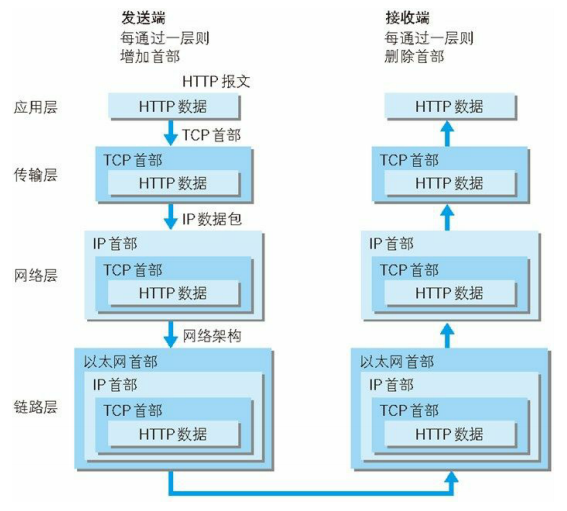
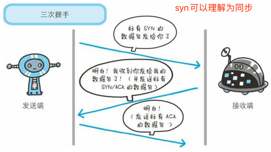
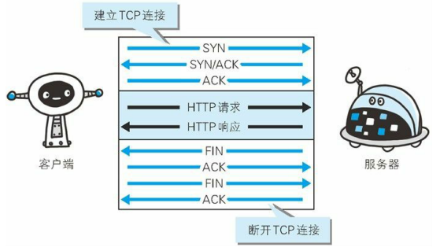
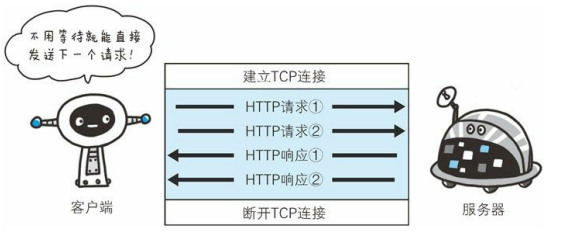
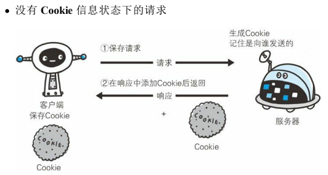

#md使用方式
    https://www.cnblogs.com/xihailong/p/13919914.html
#web及网络基础
http超文本传输协议

TCP/IP协议族是互联网相关联的协议集合的总称
##协议分层

应用层: 应用层决定了向用户提供应用服务时通信的活动。

传输层: 提供处于网络连接中的两台计算机之间的数据传输。

网络层: 用来处理在网络上流动的数据包。数据包是网络传输的最小数 据单位。该层规定了通过怎样的路径（所谓的传输路线）到达对方计 算机，并把数据包传送给对方。

链路层: 用来处理连接网络的硬件部分。包括控制操作系统、硬件的设备驱 动、NIC（Network Interface Card，网络适配器，即网卡），及光纤等 物理可见部分（还包括连接器等一切传输媒介）。硬件上的范畴均在 链路层的作用范围之内。

首先作为发送端的客户端在应用层（HTTP 协议）发出一个想看某个 Web 页面的 HTTP 请求。 

接着，为了传输方便，在传输层（TCP 协议）把从应用层处收到的数 据（HTTP 请求报文）进行分割，并在各个报文上打上标记序号及端 口号后转发给网络层。

在网络层（IP 协议），增加作为通信目的地的 MAC 地址后转发给链 路层。这样一来，发往网络的通信请求就准备齐全了。 

接收端的服务器在链路层接收到数据，按序往上层发送，一直到应用层。当传输到应用层，才能算真正接收到由客户端发送过来的HTTP请求。

发送端在层与层之间传输数据时，每经过一层时必定会被打上一个该 层所属的首部信息。反之，接收端在层与层传输数据时，每经过一层 时会把对应的首部消去。

##IP/TCP/DNS协议
IP（Internet Protocol）网际协议位于网络层,“IP”和“IP 地址”不是一个东西，“IP”其实是一种协议的名称。IP 协议的作用是把各种数据包传送给对方。

TCP 位于传输层，提供可靠的字节流服务。字节流服务（Byte Stream Service）是指，为了方便传输，将大 块数据分割成以报文段（segment）为单位的数据包进行管理。

DNS（Domain Name System）服务是位于应用层的协议。它提供域名到 IP 地址之间的解析服务。

##三次握手

##各协议作用

##URL与URI
URL是URI的子集

#简单的http协议
##持久连接
初始http版本中,每进行一次 HTTP 通信就要断开一次 TCP 连接。

持久连接: 接旨在建立 1 次 TCP 连接后进行多次请求和响应的交互

管线化: 不用等待响应亦可直接发送下一个请求。

##cookie & session

#http报文内的http信息
##编码提升传输速率
通过在传输时编码，能有效地处理大量 的访问请求。但是，编码的操作需要计算机来完成，因此会消耗更多 的 CPU 等资源。

常用的编码: 

gzip（GNU zip）   
compress（UNIX 系统的标准压缩）   
deflate（zlib） 
identity（不进行编码）

##报文主体和实体主体的差异
报文（message） 是 HTTP 通信中的基本单位，由 8 位组字节流（octet sequence， 其中 octet 为 8 个比特）组成，通过 HTTP 通信传输。

实体是指实际传输的内容

通常，报文主体等于实体主体。只有当传输中进行编码操作时，实体 主体的内容发生变化，才导致它和报文主体产生差异。

#返回结果的http状态码

状态码和状况的不一致情况: 不少返回的状态码响应都是错误的，但是用户可能察觉不到这点。 比如 Web 应用程序内部发生错误，状态码依然返回 200 OK，这种 情况也经常遇到。

#与http协作的web服务器

单台虚拟主机可以实现多个域名,因此在发送 HTTP 请求时，必须在 Host 首部内完整指 定主机名或域名的 URI。

##通信数据转发程序

代理: 代理是一种有转发功能的应用程序，它扮演了位于服务器和客户 端“中间人”的角色，接收由客户端发送的请求并转发给服务器，同时 也接收服务器返回的响应并转发给客户端。 

    代理有多种使用方法，按两种基准分类。一种是是否使用缓存，另一 种是是否会修改报文。 缓存代理 代理转发响应时，

    缓存代理（Caching Proxy）会预先将资源的副本 （缓存）保存在代理服务器上。 当代理再次接收到对相同资源的请求时，就可以不从源服务器那里获 取资源，而是将之前缓存的资源作为响应返回。 

    透明代理 转发请求或响应时，不对报文做任何加工的代理类型被称为透明代理 （Transparent Proxy）。反之，对报文内容进行加工的代理被称为非 透明代理。

网关: 网关是转发其他服务器通信数据的服务器，接收从客户端发送来的请 求时，它就像自己拥有资源的源服务器一样对请求进行处理。有时客 户端可能都不会察觉，自己的通信目标是一个网关。 

    网关的工作机制和代理十分相似。而网关能使通信线路上的服务器提 供非 HTTP 协议服务。 
    利用网关能提高通信的安全性，因为可以在客户端与网关之间的通信 线路上加密以确保连接的安全。比如，网关可以连接数据库，使用 SQL语句查询数据。另外，在 Web 购物网站上进行信用卡结算时， 网关可以和信用卡结算系统联动。
隧道: 隧道是在相隔甚远的客户端和服务器两者之间进行中转，并保持双方 通信连接的应用程序。

    隧道可按要求建立起一条与其他服务器的通信线路，届时使用 SSL等 加密手段进行通信。隧道的目的是确保客户端能与服务器进行安全的 通信。

##缓存
记得缓存是要有期限的,以防资源变更后还是用缓存的情况

#http首部

Upgrade: 用于检测 HTTP 协议及其他协议是否可使用更高的 版本进行通信，其参数值可以用来指定一个完全不同的通信协议。

Via: 使用首部字段 Via 是为了追踪客户端与服务器之间的请求和响应报文 的传输路径。

User-Agent: 首部字段 User-Agent 会将创建请求的浏览器和用户代理名称等信息传 达给服务器。 由网络爬虫发起请求时，有可能会在字段内添加爬虫作者的电子邮件 地址。此外，如果请求经过代理，那么中间也很可能被添加上代理服 务器的名称。

#https
#确认访问用户身份的认证
#给予http的功能追加协议
#构建web内容的技术
#web的攻击技术
