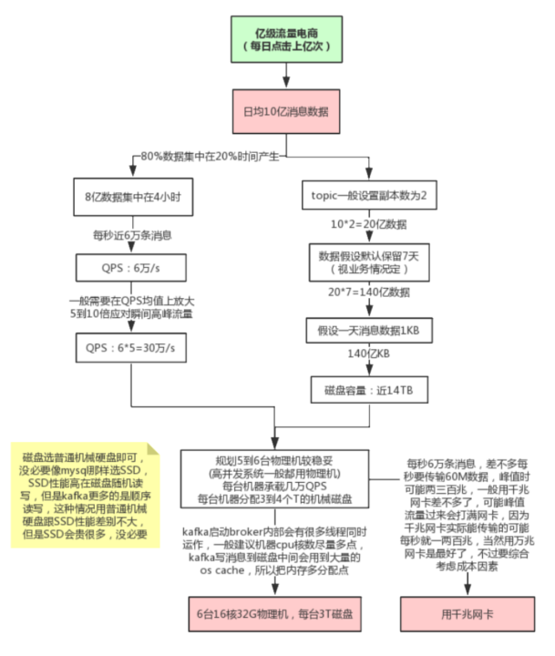

线上环境规划

####JVM参数设置

kafka是scala语言开发，运行在JVM上，需要对JVM参数合理设置，参看JVM调优专题 修改bin/kafka-start-server.sh中的jvm设置，假设机器是32G内存，可以如下设置：

    export KAFKA_HEAP_OPTS="‐Xmx16G ‐Xms16G ‐Xmn10G ‐XX:MetaspaceSize=256M ‐XX:+UseG1GC ‐XX:MaxGCPauseMillis=50 ‐XX:G1He apRegionSize=16M"

这种大内存的情况一般都要用G1垃圾收集器，因为年轻代内存比较大，用G1可以设置GC最大停顿时间，不至于一次minor gc就花费太长 时间，当然，因为像kafka，rocketmq，es这些中间件，
    写数据到磁盘会用到操作系统的page cache，所以JVM内存不宜分配过大，需要给操作系统的缓存留出几个G。

####线上问题及优化
消息丢失情况： 

    消息发送端： 
        （1）acks=0： 表示producer不需要等待任何broker确认收到消息的回复，就可以继续发送下一条消息。性能最高，但是最容易丢消 息。大数据统计报表场景，对性能要求很高，
            对数据丢失不敏感的情况可以用这种。 
        （2）acks=1： 至少要等待leader已经成功将数据写入本地log，但是不需要等待所有follower是否成功写入。就可以继续发送下一条消 息。这种情况下，如果follower没有
            成功备份数据，而此时leader又挂掉，则消息会丢失。 
        （3）acks=-1或all： 这意味着leader需要等待所有备份(min.insync.replicas配置的备份个数)都成功写入日志，这种策略会保证只要有一 个备份存活就不会丢失数据。
            这是最强的数据保证。一般除非是金融级别，或跟钱打交道的场景才会使用这种配置。当然如果 min.insync.replicas配置的是1则也可能丢消息，跟acks=1情况类似。

    消息消费端： 如果消费这边配置的是自动提交，万一消费到数据还没处理完，就自动提交offset了，但是此时你consumer直接宕机了，未处理完的数据 丢失了，下次也消费不到了。

分区数越多吞吐量越高吗? no

