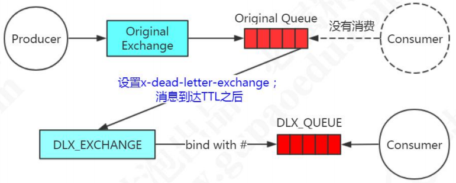

工作模型

    
    Broker
    Connection: 无论是生产者发送消息，还是消费者接收消息，都必须要跟 Broker 之间建立一个连接，这个连接是一个 TCP 的长连接。
    Channel:它是一个虚拟的连接。我们把它翻译 成通道，或者消息信道。这样我们就可以在保持的 TCP 长连接里面去创建和释放 Channel，大大了减少了资源消耗。
    Queue:
    Exchange:
    Vhost:

交换机模型

直连交换机:完全匹配key

广播交换机:广播给所有的与它绑定的Queue上,不匹配key

主体交换机:根据通配符对Routing key进行匹配

    Routing key必须是一串字符串，每个单词用“.”分隔；
    符号“#”表示匹配一个或多个单词；
    符号“*”表示匹配一个单词。
    例如：“*.123” 能够匹配到 “abc.123”，但匹配不到 “abc.def.123”；“#.123” 既能够匹配到 “abc.123”，也能匹配到 “abc.def.123”。

消息的过期时间:
    
    1.通过队列属性设置消息过期时间 所有队列中的消息超过时间未被消费时，都会过期
        @Bean("ttlQueue") 
        public Queue queue(){
            Map <String, Object> map=new HashMap<String, Object>();
            map.put("x-message-ttl",11000);
            // 队列中的消息未被消费 11 秒后过期
            return new Queue("GP_TTL_QUEUE", true, false, false, map);
        }
    2.设置单条消息的过期时间
        MessageProperties messageProperties = new MessageProperties(); 
        messageProperties.setExpiration("4000");
        // 消息的过期属性，单位 ms
        Message message = new Message("这条消息 4 秒后过期".getBytes(), messageProperties);
        rabbitTemplate.send("GP_TTL_EXCHANGE", "gupao.ttl", message);
    3.如果前面2个都指定了, 那么时间小的那个生效.

##死信队列

    队列在创建的时候可以指定一个死信交换机 DLX（Dead Letter Exchange）。 死信交换机绑定的队列被称为死信队列 DLQ（Dead Letter Queue），
        DLX 实际上 也是普通的交换机，DLQ 也是普通的队列（例如替补球员也是普通球员）。
什么情况下消息会变成死信？

    1）消息被消费者拒绝并且未设置重回队列：(NACK || Reject ) && requeue == false 
    2）消息过期 
    3）队列达到最大长度，超过了 Max length（消息数）或者 Max length bytes （字节数），最先入队的消息会被发送到 DLX。

死信队列如何使用？见代码DeadQueue.java

消息流转过程:

##延迟队列:

场景:1、 家里有一台智能热水器，需要在 30 分钟后启动    2、 未付款的订单，15 分钟后关闭

RabbitMQ 本身不支持延迟队列，总的来说有三种实现方案：

    1、 先存储到数据库，用定时任务扫描
    2、 利用 RabbitMQ 的死信队列（Dead Letter Queue）实现 
        设置消息过期时间,然后不去消费这个消息, 等到消息超时之后,会自动进入死信队列,消费者处理死信队列里的消息即可达到延迟处理效果
        缺点:1） 如果统一用队列来设置消息的 TTL，当梯度非常多的情况下，比如 1 分钟，2 分钟，5 分钟，10 分钟，20 分钟，30 分钟……需要创建很多交换机和队列来路由消息。
            2） 如果单独设置消息的 TTL，则可能会造成队列中的前一条消息没有出队（没有被消费），后面的消息无法投递,即便后面的消息已经到时间了.(前一条消息过期时间10分钟,后面一条5分钟)
            3） 可能存在一定的时间误差。    
    3、 利用 rabbitmq-delayed-message-exchange 插件
        通过声明一个 x-delayed-message 类型的 Exchange 来使用 delayed-messaging 特性。x-delayed-message 是插件提供的类型，并不是 rabbitmq 本身的
        （区别于 direct、 topic、fanout、headers）。使用方式见DelayQueue.java

##服务端流控（Flow Control）

场景: 当 RabbitMQ 生产 MQ 消息的速度远大于消费消息的速度时，会产生大量的消息堆积，占用系统资源，导致机器的性能下降。要控制服务端接收的消息的数量，应该怎么做？

1.队列有两个控制长度的属性：

    x-max-length：队列中最大存储最大消息数，超过这个数量，队头的消息会被丢弃。
    x-max-length-bytes：队列中存储的最大消息容量（单位 bytes），超过这个容 量，队头的消息会被丢弃。
    设置队列长度只在消息堆积的情况下有意义，而且会删除先入队的 消息，不能真正地实现服务端限流
2.内存控制

    RabbitMQ 会在启动时检测机器的物理内存数值。默认当 MQ 占用 40% 以上内 存时，MQ 会主动抛出一个内存警告并阻塞所有连接（Connections）。
    可以通过修改 rabbitmq.config 文件来调整内存阈值，默认值是 0.4，
        [{rabbit, [{vm_memory_high_watermark, 0.4}]}].
    也可以用命令动态设置，如果设置成 0，则所有的消息都不能发布。
        rabbitmqctl set_vm_memory_high_watermark 0.3
3.磁盘控制

    当磁盘空间低于指定的值时（默认 50MB），触发流控措施。 例如：指定为磁盘的 30%或者 2GB：
        disk_free_limit.relative = 3.0 
        disk_free_limit.absolute = 2GB

##消费端限流

场景:在消费者处理消息的能力有限，例如消费者数量太少，或者单条消息的处理时间过 长的情况下，如果我们希望在一定数量的消息消费完之前，不再推送消息过来，就要用 到消费端的流量限制措施.

    可以基于 Consumer 或者 channel 设置 prefetch count 的值，含义为 Consumer端的最大的 unacked messages 数目。当超过这个数值的消息未被确认，
    RabbitMQ 会 停止投递新的消息给该消费者。例如: 如果超过 2 条消息没有发送 ACK，当前消费者不再接受队列消息 
        原生方式:
            channel.basicQos(2); // 如果超过 2 条消息没有发送 ACK，当前消费者不再接受队列消息 
            channel.basicConsume(QUEUE_NAME, false, consumer)
        SimpleMessageListenerContainer方式:
            container.setPrefetchCount(2);
        Spring Boot 配置方式：
            spring.rabbitmq.listener.simple.prefetch=2

Spring集成AMQP时，它做了什么？SpringAMQP包括什么？

CachingConnectionFactory
RabbitAdmin
Message
RabbitTemplate
MessageListener
MessageListenerContainer（SimpleDirect）
MessageListenerContainerFactory
MessageConvertor

<rabbit:connection-factory
<rabbit:admin
<rabbit:queue
<rabbit:direct-exchange
<rabbit:bindings
<rabbit:template
<rabbit:listener-container

RabbitConfig.java 消费者
生产者

