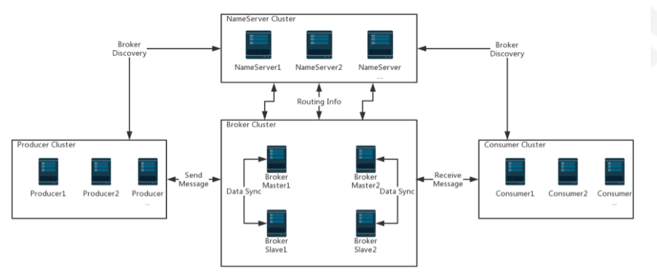
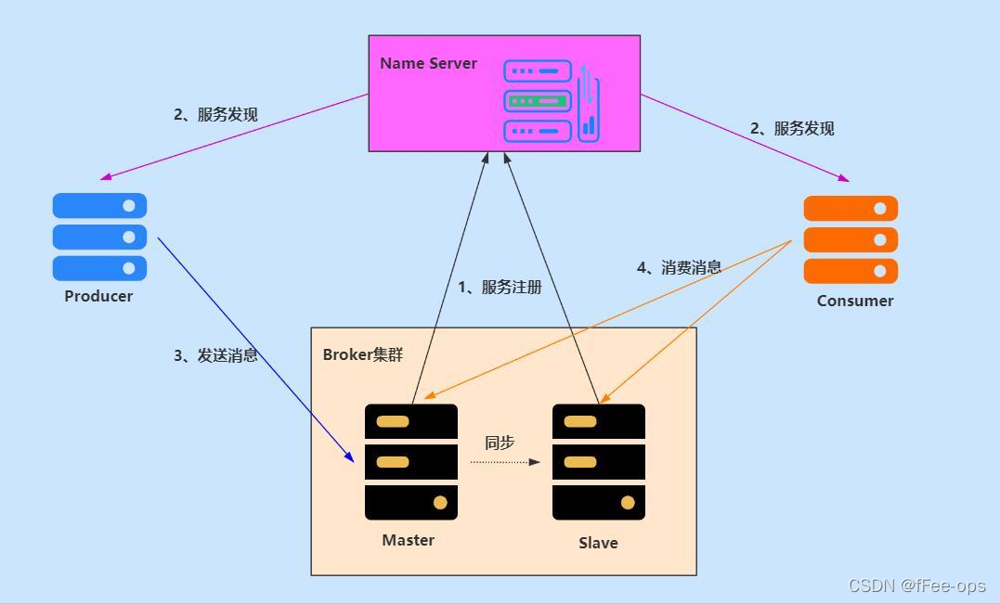
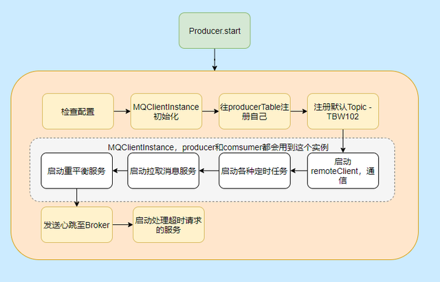
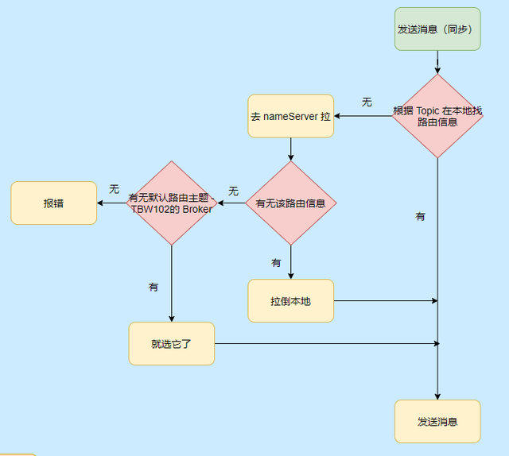
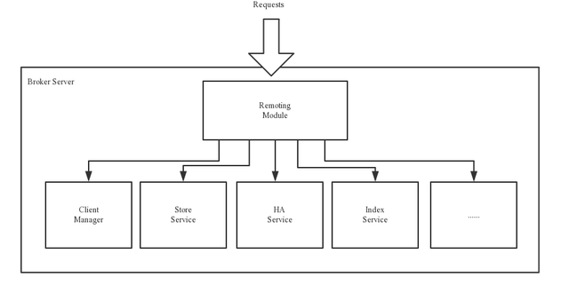
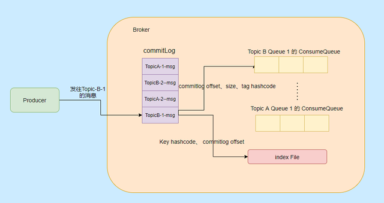
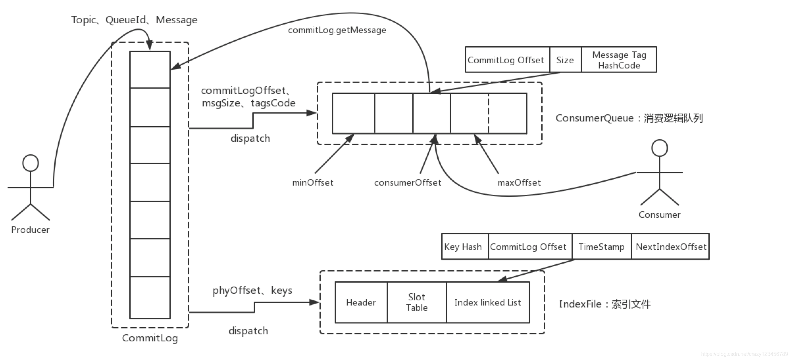
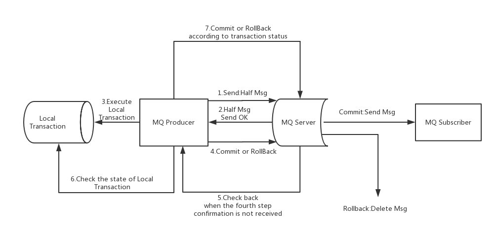

[RocketMQ](https://baijiahao.baidu.com/s?id=1682264626057308329&wfr=spider&for=pc)
[参考](https://blog.csdn.net/crazy123456789/article/details/118165367)

RocketMQ支持事务消息、顺序消息、批量消息、定时消息、消息回溯等

特点:

    1.支持发布/订阅（Pub/Sub）和点对点（P2P）消息模型
    2.在一个队列中可靠的先进先出（FIFO）和严格的顺序传递 （RocketMQ可以保证严格的消息顺序，而ActiveMQ无法保证）
        RocketMQ的push其实是基于pull来实现的。 它会先由一个业务代码从MQ中pull消息，然后再由业务代码push给特定的应用/消费者。其实底层就是一个pull模式
    3.支持拉（pull）和推（push）两种消息模式
    4.单一队列百万消息的堆积能力 （RocketMQ提供亿级消息的堆积能力，这不是重点，重点是堆积了亿级的消息后，依然保持写入低延迟）
    5.支持多种消息协议，如 JMS、MQTT 等
    6.分布式高可用的部署架构,满足至少一次消息传递语义（RocketMQ原生就是支持分布式的，而ActiveMQ原生存在单点性）
    7.提供 docker 镜像用于隔离测试和云集群部署
    8.提供配置、指标和监控等功能丰富的 Dashboard

RocketMQ 优势: 目前主流的 MQ 主要是 RocketMQ、kafka、RabbitMQ

    支持事务型消息（消息发送和 DB 操作保持两方的最终一致性，RabbitMQ 和 Kafka 不支持）
    支持结合 RocketMQ 的多个系统之间数据最终一致性（多方事务，二方事务是前提）
    支持 18 个级别的延迟消息（Kafka 不支持）
    支持指定次数和时间间隔的失败消息重发（Kafka 不支持，RabbitMQ 需要手动确认）
    支持 Consumer 端 Tag 过滤，减少不必要的网络传输（即过滤由MQ完成，而不是由消费者完成。RabbitMQ 和 Kafka 不支持）
    支持重复消费（RabbitMQ 不支持，Kafka 支持）

RocketMQ主要有四大核心组成部分：NameServer、Broker、Producer以及Consumer四部分。

NameServer:

    NameServer是一个几乎无状态节点，可集群部署，节点之间无任何信息同步。
    NameServer 是整个 RocketMQ 的“大脑” ，它是RocketMQ的服务注册中心，所以RocketMQ需要先启动NameServer再启动Rocket中的Broker。
    NameServer 用来保存 Broker 相关元信息并给 Producer 和 Consumer 查找Broker 信息。NameServer 被设计成几乎无状态的，
        可以横向扩展，节点之间相互之间无通信，通过部署多台机器来标记自己是一个伪集群。
    Name Server之间不互连，这就需要broker端连接所有的Name Server，运行数据的改动要发送到每一个Name Server来保证运行数据的一致性
        （这个一致性确实有点弱），这样就变成了Name Server很轻量级，但是broker端就要做更多的东西了。
    NameServer 与每台 Broker 服务保持长连接，Broker定时(每隔30s)注册Topic信息到所有Name Server。Name Server定时(每隔10s)
        扫描所有存活broker的连接，如果Name Server超过2分钟没有收到心跳，则Name Server断开与Broker的连接。这样就可以实现 RocketMQ 的高可用。

Broker:

    消息服务器（Broker）是消息存储中心，主要作用是接收来自 Producer 的消息并存储，Consumer 从这里取得消息。它还存储与消息相关的元数据，包括用户组、消费进度偏移量、
        队列信息等。从部署结构图中可以看出 Broker 有 Master 和 Slave 两种类型，Master 既可以写又可以读，Slave不可以写只可以读。
    一个Master可以对应多个Slave，但是一个Slave只能对应一个Master，Master与Slave的对应关系通过指定相同的Broker Name，不同的BrokerId来定义，BrokerId为0表Master，
        非0表示Slave。Master也可以部署多个。Broker 的集群部署方式有四种：单 Master 、多 Master 、多 Master 多Slave（同步刷盘）、多 Master多 Slave（异步刷盘）。
            单 Master:一旦 Broker 重启或宕机会导致整个服务不可用,不建议使用
            多 Master没有Slave: 单台机器宕机期间，该机器上未被消费的消息在机器恢复之前不可订阅，消息实时性会受影响。
            多 Master多Slave（异步复制）:每个 Master 配置一个 Slave,异步复制方式，主备之间有毫秒级消息延迟。 Master 宕机时在磁盘损坏情况下会丢失极少量消息。
            多 Master多Slave（同步双写）:每个 Master 配置一个 Slave，消息采用同步双写方式，主备都写成功才返回成功。性能相对异步复制方式略低，发送消息的延迟会略高。

Producer

    生产者向brokers发送由业务应用程序系统生成的消息。RocketMQ提供了发送：同步、异步和单向（one-way）的多种方式。
        同步发送:消息发送方发出数据后会在收到接收方发回响应之后才发下一个数据包。一般用于重要通知消息，例如重要通知邮件、营销短信。
        异步发送:异步发送指发送方发出数据后，不等接收方发回响应，接着发送下个数据包，一般用于可能链路耗时较长而对响应时间敏感的业务场景，例如用户视频上传后通知启动转码服务。
            假如过一段时间检测到某个信息发送失败，可以选择重新发送。
        单向发送:单向发送是指只负责发送消息而不等待服务器回应且没有回调函数触发，适用于某些耗时非常短但对可靠性要求并不高的场景，例如日志收集。

    生产者组:
        生产者组（Producer Group）是一类 Producer 的集合，这类 Producer 通常发送一类消息并且发送逻辑一致，所以将这些 Producer 分组在一起。从部署结构上看生产者通过 
            Producer Group 的名字来标记自己是一个集群。

    高可用保障:
        Producer与Name Server集群中的其中一个节点(随机选择)建立长连接，定期从Name Server取Topic路由信息，并向提供Topic服务的Master建立长连接，
            且定时向Master发送心跳。Producer完全无状态，可集群部署。
        Producer每隔30s（由ClientConfig的pollNameServerInterval）从Name server获取所有topic队列的最新情况，这意味着如果Broker不可用，Producer
            最多30s能够感知，在此期间内发往Broker的所有消息都会失败。
        Producer每隔30s（由ClientConfig中heartbeatBrokerInterval决定）向所有关联的broker发送心跳，Broker每隔10s中扫描所有存活的连接，如果Broker
            在2分钟内没有收到心跳数据，则关闭与Producer的连接。
Consumer

    消费者组（Consumer Group）一类 Consumer 的集合名称，这类 Consumer 通常消费同一类消息并且消费逻辑一致，所以将这些 Consumer 分组在一起。消费者组与生产者组类似，
        都是将相同角色的分组在一起并命名。
        RocketMQ中的消息有个特点，同一条消息，只能被某一消费组其中的一台机器消费，但是可以同时被不同的消费组消费。
    消费有两种模式，分别是广播模式和集群模式。
        广播模式:一个分组下的每个消费者都会消费完整的Topic 消息。
        集群模式:一个分组下的消费者瓜分消费Topic 消息。
    高可用保障:
        Consumer与Name Server集群中的其中一个节点(随机选择)建立长连接，定期从Name Server取Topic路由信息，并向提供Topic服务的Master、Slave建立长连接，
            且定时向Master、Slave发送心跳。Consumer既可以从Master订阅消息，也可以从Slave订阅消息，订阅规则由Broker配置决定。
        Consumer每隔30s从Name server获取topic的最新队列情况，这意味着Broker不可用时，Consumer最多最需要30s才能感知。
        Consumer每隔30s（由ClientConfig中heartbeatBrokerInterval决定）向所有关联的broker发送心跳，Broker每隔10s扫描所有存活的连接，若某个连接2分钟内
            没有发送心跳数据，则关闭连接；并向该Consumer Group的所有Consumer发出通知，Group内的Consumer重新分配队列，然后继续消费。
        Consumer得到master宕机通知后，转向slave消费，slave不能保证master的消息100%都同步过来了，因此会有少量的消息丢失。但是一旦master恢复，未同步过去的
            消息会被最终消费掉。

运转流程

    1.NameServer 先启动
    2.Broker 启动时向 NameServer 注册
    3.生产者在发送某个主题的消息之前先从 NamerServer 获取 Broker 服务器地址列表（有可能是集群），然后根据负载均衡算法从列表中选择一台Broker 进行消息发送。
    4.NameServer 与每台 Broker 服务器保持长连接，并间隔 30S 检测 Broker 是否存活，如果检测到Broker 宕机（使用心跳机制， 如果检测超120S），则从路由注册表中将其移除。
    5.消费者在订阅某个主题的消息之前从 NamerServer 获取 Broker 服务器地址列表（有可能是集群），但是消费者选择从 Broker 中 订阅消息，订阅规则由 Broker 配置决定

Producer 启动流程

定时任务

发消息流程

    TBW102 :接受自动创建主题的 Broker, 在启动时会把TBW102这个默认主题登记到 NameServer，这样当 Producer 发送新 Topic 的消息时候就得知哪个 Broker 
        可以自动创建主题，然后发往那个 Broker。而 Broker 接受到这个消息的时候发现没找到对应的主题，但是它接受创建新主题，这样就会创建对应的 Topic 路由信息。
        但是不建议线上开启允许自动创建主题,原因如下:
            1. 自动创建主题那么有可能该主题的消息都只会发往一台 Broker，起不到负载均衡的作用。 
            2.  心跳是每 30s 发送一次,NameServer 最长需要 30s 才能得知这个新 Topic 的路由信息。
消息:

    一条消息必须有一个主题（Topic）也可以拥有一个可选的标签（Tag）,标签（Tag）可以看作子主题，它是消息的第二级类型.
        简单来说TOPIC可以看作衣服，而TAG可以看作衣服下的【短袖】、【外套】、【卫衣】等

消息顺序:

    顺序消费（Orderly）:如果正在处理全局顺序是强制性的场景，需要确保使用的主题只有一个消息队列。这个顺序，不是全局顺序，只是分区（queue）顺序。
        要全局顺序只能一个分区，但是同一条queue里面，RocketMQ的确是能保证FIFO的。
    并行消费（Concurrently）:消费的最大并行数量受每个消费者客户端指定的线程池限制。
    RocketMQ中提供了MessageListenerOrderly 一个类来实现顺序消费，
        consumer.subscribe("store_topic_test","*");
        consumer.registerMessageListener((MessageListenerOrderly)(list,consumeOrderlyContext)->{
            list.stream().forEach(messageExt->System.out.println(new
            String(messageExt.getBody())));
            returnConsumeOrderlyStatus.SUCCESS;
        });
    问题:
        1. 遇到消息失败的消息，无法跳过，当前队列消费暂停
        2. 降低了消息处理的性能

高效的IO存储机制:

    RocketMQ消息存储文件设计成文件组的概念，组内单个文件大小固定，方便引入内存映射机制。 内存映射和linux的零copy里面的内存映射是同一个意思
    所有主题的消息存储基于顺序写，提升写性能，同时为了兼顾消息消费与消息查找，引入了消息消费队列文件与索引文件。

Broker 有几个重要的子模块:

    1.远程处理Remoting模块，是Broker 入口，处理来自客户端的请求
    2.Client Manager 客户端管理，管理客户端（包括消息生产者和消费者），维护消费者的主题订阅
    3.Store Service 存储服务，提供在物理硬盘上存储和查询消息的简单 API
    4.HA Serivce服务，提供主从 Broker 间数据同步,高可用
    5.Index Serivce索引服务，通过指定键为消息建立索引并提供快速消息查询
Broker的存储:RocketMQ 存储用的是本地文件存储系统，效率高也可靠, 主要涉及到三种类型的文件:

    CommitLog:存储所有主题的消息,所有消息都是顺序写入的，超过文件大小则开启下一个文件。单个 CommitLog 默认 1G
    ConsumeQueue:消息消费队列，可以认为是 CommitLog 中消息的索引，因为 CommitLog 是糅合了所有主题的消息，所以通过索引才能更加高效的查找消息。
        消费者是先从 ConsumeQueue 来得到消息真实的物理地址，然后再去 CommitLog 获取消息。
    IndexFile:IndexFile 就是索引文件，是额外提供查找消息的手段，不影响主流程。通过 Key 或者时间区间来查询对应的消息，文件名以创建时间戳命名，
        固定的单个 IndexFile 文件大小约为400M，一个 IndexFile 存储 2000W个索引。

    消息到了先存储到 Commitlog，然后会有一个 ReputMessageService 线程接近实时地将消息转发给消息消费队列文件与索引文件，也就是说是异步生成的。
    每条消息都会有对应的索引信息，Consumer通过ConsumeQueue这个二级索引来读取消息实体内容，其流程如下：

消息存储过期机制:

    RocketMQ追求消息存储的高性能，引入内存映射机制，所有主题的消息顺序存储在同一个文件中。同时为了避免消息无限在消息存储服务器中累积，引入了消息
        文件过期机制与文件存储空间报警机制。
    消息存储文件并不是永久存储在消息服务器端，而是提供了过期机制，默认保留3天。
确保消息必须被消费一次

    RocketMQ通过消息消费确认机制（ACK）来确保消息至少被消费一次，但由于ACK消息有可能丢失等其他原因，RocketMQ无法做到消息只被消费一次，有重复消费的可能。
回溯消息:指消息消费端已经消费成功的消息，由于业务要求需要重新消费消息。RocketMQ支持按时间回溯消息，时间维度可精确到毫秒，可以向前或向后回溯。

定时(延时消费)消息: 只支持特定延迟级别。

发送消息故障延迟机制: 重试 延迟机制

    有一个参数是 sendLatencyFaultEnable，默认不开启。这个参数的作用是对于之前发送超时的 Broker 进行一段时间的退避。发送消息会记录此时发送消息的时间，
        如果超过一定时间，那么此 Broker 就在一段时间内不允许发送。比如发送时间超过 15000ms 则在 600000 ms 内无法向该 Broker 发送消息。
        这个机制其实很关键，发送超时大概率表明此 Broker 负载高，所以先避让一会儿，让它缓一缓，这也是实现消息发送高可用的关键。

Consumer 消息消费的重试

    1.一般的消费失败要么就是消息结构有误，要么就是一些暂时无法处理的状态，所以立即重试不太合适。
    2.RocketMQ 会给每个消费组都设置一个重试队列，Topic 是 %RETRY%+consumerGroup，并且设定了很多重试级别来延迟重试的时间。
    3.重试的消息会先保存在 Topic 名称为“SCHEDULE_TOPIC_XXXX”的延迟队列，在消息的扩展字段里面会存储原来所属的 Topic 信息。
        delay 一段时间后再恢复到重试队列中，然后 Consumer 就会消费这个重试队列主题，得到之前的消息。
        如果重试超过一定的次数则会移入到死信队列，即 Topic %DLQ%" + ConsumerGroup 中，存储死信队列即认为消费成功。 然后可以通过人工来处理死信队列的这些消息。

最佳实践:

    Tags的使用: 建议一个应用一个 Topic，利用 tages 来标记不同业务，因为 tages 设置比较灵活，且一个应用一个 Topic 很清晰，能直观的辨别。
    Keys的使用:如果有消息业务上的唯一标识，请填写到 keys 字段中，方便日后的定位查找。

提高 Consumer 的消费能力

    1、提高消费并行度：增加队列数和消费者数量，提高单个消费者的并行消费线程，参数 consumeThreadMax。
    2、批处理消费，设置 consumeMessageBatchMaxSize 参数，这样一次能拿到多条消息，然后比如一个 update语句之前要执行十次，现在一次就执行完。
    3、跳过非核心的消息，当负载很重的时候，为了保住那些核心的消息，设置那些非核心的消息，例如此时消息堆积 1W 条了之后，就直接返回消费成功，跳过非核心消息。

##事务消息

RocketMQ的事务消息提供类似 X/Open XA 的分布式事务功能，通过事务消息能达到分布式事务的最终一致。
注意: RocketMQ事务是指的发送方的"本地事务 + 发送到mq的消息",即"本地事务 + 发送到mq的消息"是一个整体,一个失败都失败,一个成功则都成功.

采用了2PC（两阶段提交）+ 补偿机制（事务状态回查）的思想来实现了提交事务消息，同时增加一个补偿逻辑来处理二阶段超时或者失败的消息，如下图所示。

上图中事务消息主要分为两个流程：

1.正常事务消息的发送及提交:

    1、生产者发送half消息到Broker服务端（半消息）；
        半消息是一种特殊的消息类型，该状态的消息暂时不能被Consumer消费。当一条事务消息被成功投递到Broker上，但是Broker并没有
        接收到Producer发出的二次确认时，该事务消息就处于"暂时不可被消费"状态，该状态的事务消息被称为半消息。
    2、Broker服务端将消息持久化之后，给生产者响应消息写入结果（ACK响应）；
    3、生产者根据发送结果执行本地事务逻辑（如果写入失败，此时half消息对业务不可见，本地逻辑不执行）；
    4、生产者根据本地事务执行结果向Broker服务端提交二次确认（Commit 或是 Rollback），Broker服务端收到 Commit 状态则将半事务
        消息标记为可投递，订阅方最终将收到该消息；Broker服务端收到 Rollback 状态则删除半事务消息，订阅方将不会接收该消息；
    
2.事务消息的补偿流程

    5、在网络闪断或者是应用重启的情况下，可能导致生产者发送的二次确认消息(即上面的第4步)未能到达Broker服务端，经过固定时间后，Broker服务端将会对
        没有Commit/Rollback的事务消息（pending状态的消息）进行“回查”；
    6、生产者收到回查消息后，检查回查消息对应的本地事务执行的最终结果；
    7、生产者根据本地事务状态，再次提交二次确认给Broker，然后Broker重新对半事务消息Commit或者Rollback；
    注: 补偿阶段(5,6,7)用于解决消息Commit或者Rollback发生超时或者失败的情况。

事务消息共有三种状态，提交状态、回滚状态、中间状态：

    TransactionStatus.CommitTransaction：提交事务，它允许消费者消费此消息。
    TransactionStatus.RollbackTransaction：回滚事务，它代表该消息将被删除，不允许被消费。
    TransactionStatus.Unknown：中间状态，它代表需要回查本地事务状态来决定是提交还是回滚事务。

##事务消息原理
    
设计思想:
    
    如果消息是half消息，将备份原消息的主题与消息消费队列，然后改变主题为RMQ_SYS_TRANS_HALF_TOPIC。由于消费组未订阅该主题，故消费端无法消费half类型的消息。

如何实现事务回查？

    roker会启动一个消息回查的定时任务，定时从事务消息queue中读取所有待反查的消息。针对每个需要反查的半消息，Broker会给对应的Producer发一个要求执行事务状态反查
        的RPC请求。然后根据RPC返回响应中的反查结果，来决定这个半消息是需要提交还是回滚，或者后续继续来反查。最后，提交或者回滚事务，将半消息标记为已处理状态【将消
        息存储在主题为：RMQ_SYS_TRANS_OP_HALF_TOPIC的主题中，代表这些消息已经被处理（提交或回滚）】。 如果是提交事务，就把半消息从半消息队列中复制到该消息真正
        的topic和queue中； 如果是回滚事务，则什么都不做。
    注: 1.rocketmq并不会无休止的的信息事务状态回查，默认回查15次，如果15次回查还是无法得知事务状态，rocketmq默认丢弃该消息。
        2.改变消息主题是RocketMQ的常用“套路”

RocketMQ事务消息使用限制

    1.事务消息不支持延时消息和批量消息；
    2.事务性消息可能不止一次被检查或消费，所以消费者端需要做好消费幂等；
    3.为了避免单个消息被检查太多次而导致半队列消息累积，我们默认将单个消息的检查次数限制为 15 次（即默认只会回查15次），我们可以通过 Broker 配置文件的 
        transactionCheckMax参数来修改此限制。如果已经检查某条消息超过 N 次的话（ N = transactionCheckMax ）， 则 Broker 将丢弃此消息，并在默认情况下同时打
        印错误日志。用户可以通过重写 AbstractTransactionCheckListener 类来修改这个行为；
    4.事务消息将在 Broker 配置文件中的参数 transactionMsgTimeout 这样的特定时间长度之后被检查。当发送事务消息时，用户还可以通过设置用户属性 
        CHECK_IMMUNITY_TIME_IN_SECONDS 来改变这个限制，该参数优先于 transactionMsgTimeout 参数；
    5.提交给用户的目标主题消息可能会失败，目前这依日志的记录而定。它的高可用性通过 RocketMQ 本身的高可用性机制来保证，如果希望确保事务消息不丢失、并且事务完整性得到保证，
        建议使用同步的双重写入机制。
    6.事务消息的生产者 ID 不能与其他类型消息的生产者 ID 共享。与其他类型的消息不同，事务消息允许反向查询、MQ服务器能通过它们的生产者 ID 查询到消费者。

rocketMQ也提供了消息路由的功能，我们可以自定义消息分发策略，可以实现 MessageQueueSelector，来实现自己的消息分发策略

    SendResultsendResult=producer.send(msg,newMessageQueueSelector(){
        @Override
        publicMessageQueueselect(List<MessageQueue>list,Messagemessage,Object o){
            intkey=o.hashCode();
            intsize=list.size();
            intindex=key%size;
            returnlist.get(index);//list.get(0);
        }
    },"key_"+i);

