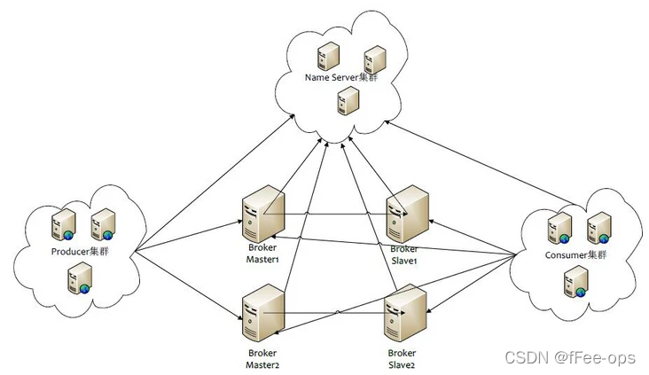

RocketMQ支持事务消息、顺序消息、批量消息、定时消息、消息回溯等

特点:

    1.支持发布/订阅（Pub/Sub）和点对点（P2P）消息模型
    2.在一个队列中可靠的先进先出（FIFO）和严格的顺序传递 （RocketMQ可以保证严格的消息顺序，而ActiveMQ无法保证）
        RocketMQ的push其实是基于pull来实现的。 它会先由一个业务代码从MQ中pull消息，然后再由业务代码push给特定的应用/消费者。其实底层就是一个pull模式
    3.支持拉（pull）和推（push）两种消息模式
    4.单一队列百万消息的堆积能力 （RocketMQ提供亿级消息的堆积能力，这不是重点，重点是堆积了亿级的消息后，依然保持写入低延迟）
    5.支持多种消息协议，如 JMS、MQTT 等
    6.分布式高可用的部署架构,满足至少一次消息传递语义（RocketMQ原生就是支持分布式的，而ActiveMQ原生存在单点性）
    7.提供 docker 镜像用于隔离测试和云集群部署
    8.提供配置、指标和监控等功能丰富的 Dashboard

RocketMQ 优势: 目前主流的 MQ 主要是 RocketMQ、kafka、RabbitMQ

    支持事务型消息（消息发送和 DB 操作保持两方的最终一致性，RabbitMQ 和 Kafka 不支持）
    支持结合 RocketMQ 的多个系统之间数据最终一致性（多方事务，二方事务是前提）
    支持 18 个级别的延迟消息（Kafka 不支持）
    支持指定次数和时间间隔的失败消息重发（Kafka 不支持，RabbitMQ 需要手动确认）
    支持 Consumer 端 Tag 过滤，减少不必要的网络传输（即过滤由MQ完成，而不是由消费者完成。RabbitMQ 和 Kafka 不支持）
    支持重复消费（RabbitMQ 不支持，Kafka 支持）

RocketMQ主要有四大核心组成部分：NameServer、Broker、Producer以及Consumer四部分。

    NameServer是一个几乎无状态节点，可集群部署，节点之间无任何信息同步。
        NameServer 是整个 RocketMQ 的“大脑” ，它是RocketMQ的服务注册中心，所以RocketMQ需要先启动NameServer再启动Rocket中的Broker。

