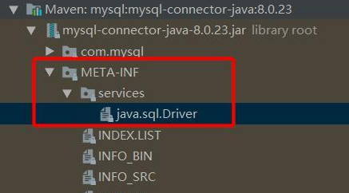

##SPI机制
[以下相关spi机制参考blog](https://www.cnblogs.com/zzyang/p/16351425.html)

###java的SPI(Service Provider Interface)机制.

    java其实就是定义了java语言跟数据库交互的接口，但是具体的实现得交给各大数据库厂商来实现，那么java怎么知道你的数据库厂商的实现了？
    这时就需要spi机制了，java好约了定在 Classpath 路径下的 META-INF/services/ 目录里创建一个以服务接口命名的文件，
    然后内容是该数据库厂商的实现的接口的全限定名，这样数据库厂商只要按照这个规则去配置，java就能找到。
    java是通过ServiceLoader类来实现读取配置文件中的实现类的。大家有兴趣可以看一下里面的代码，其实就是读取到每个jar包底下的文件，读取里面的内容。
    
以mysql为例，看一下mysql中spi是怎么实现的。

内容

###spring中的spi机制 -- SpringFactoriesLoader

    spring对于扩展文件约定在Classpath 路径下的 META-INF目录底下，所有的文件名都是叫spring.factories，文件里的内容是一个
    以键值对的方式存储的，键为类的全限定名，值也为类的全限定名，如果有多个值，可以用逗号分割，有一点得注意的是，键和值本身约定并没有类
    与类之间的依赖关系（当然也可以有，得看使用场景的约定），也就是说键值可以没有任何关联，键仅仅是一种标识，代表一种场景，最常见的自动装配的注解，
    @EnableAutoConfiguration，也就是代表自动装配的场景，当你需要你的类被自动装配，就可以以这个注解的权限定名键，你的类为名，
    这样springboot在进行自动装配的时候，就会拿这个键，找到你写的实现类来完成自动装配。
    spring在解析配置类的时候,会解析DeffredImportSelector类,里面会去扫描所有jar包下的spring.factories文件
以mybatis为例

内容

###dubbo中的spi机制 -- ExtensionLoader

    ExtensionLoader是dubbo的spi机制所实现的类，通过这个类来加载接口所有实现类，获取实现类的对象。同时每一个接口都会有一个自己的ExtensionLoader。
    
dubbo的spi机制到底是什么？它与java自带的有何区别？为什么不用java的spi机制？
    
    java的spi机制的缺点: java约定了文件名为接口的名称，内容为实现。虽然我获取到了所有的实现类，但是无法对实现类进行分类，也就是说我无法确定到底该用哪个实现类，
    并且java的spi机制会一次性给所有的实现类创建对象，如果这个对象你根本用不到，那么此时就会白白浪费资源，也就是说无法做到按需加载。
    Dubbo的SPI机制，除了提供基本java spi功能以外，还提供IOC，AOP机制(其实就是根据接口找到对应的实现类进行注入)。除此之外还对实现类进行分类,比如有api可以直接取标注了使用
        @Adaptive注解的,@Activate里同一个group的,@SPI("value")中制定value的,等等(可参考下方代码示例)
    dubbo的IOC实现方式：对于需要依赖注入的类，由于我们注入的时候，可能注入的是一个接口，那么我们怎么知道是对应哪个实现类呢？ 
        这个时候Dubbo会去帮我们获取到META-INF/services/配置中配置的实现类路径，然后去动态生成这个实现类，这个实现类可以理解成一个代理对象，
        所以当我们在使用原来依赖注入的类的时候，就会去调用实现类这个代理对象里面的方法，这样就实现了IOC的功能。
[javaSpi和dubboSpi代码示例](https://blog.csdn.net/nandao158/article/details/124558316)
    
/************下面的不用怎么看**************/

dubbo的配置文件约束
    
    dubbo会从四个目录读取文件 META-INF/dubbo/internal/ 、META-INF/dubbo/ 、META-INF/services/、META-INF/dubbo/external/，
    文件名为接口的全限定名，内容为键值对，键为短名称（可以理解为spring中的bean名称），值为实现类。
@SPI 注解的约束
    
    dubbo中所有的扩展接口，都需要在接口上加@SPI注解，不然在创建ExtensionLoader的时候，会报错。
    ExtensionDirector作用: 在3.0.3以前的版本，是没有这个类的，但是在之后的版本为了实现一些新的特性，就抽象出来了这个类，通过这个类来获取每个接口对应的ExtensionLoader
实现类的加载
    
    如果实现类加了@Adaptive注解，那么就将赋值到cachedAdaptiveClass属性上。我们叫这个类为自适应类。自适应说白了这个类本身并没有实际的意义，它是根据你的入参动态来实现找到真正的实现类来完成调用。
    如果你的实现类是有一个该类型为参数的构造方法，那么就将这个实现类放到cachedWrapperClasses中，并且我们称这个类为包装类，什么叫包装，其实跟静态代理有点像，就是将目标对象进行代理，可以增强功能。
实现类对象构造

    获取不到才构造，也就是java中spi没有的功能，按需加载。获取实现类对象的方法是getExtension方法，传入的name参数就是短名称，也就是spi文件的键，wrap是是否包装的意思，true的意思就是对你获取的目标对象进行包装，wrap默认是true
    实例化对象:通过实例化策略InstantiationStrategy进行实例化
    初始化前ExtensionPostProcessor回调,调用 ExtensionPostProcessor的postProcessBeforeInitialization方法
    依赖注入: 调用injectExtension方法依赖注入。dubbo约定 方法名以set开头，方法的参数只有一个，方法上没有加@DisableInject注解，方法是public的，符合这类的方法就是需要依赖注入的方法，dubbo在构建对象的时候会自动调用这些方法，传入相应的参数
    ExtensionAccessorAware接口回调:如果你的接口实现了ExtensionAccessorAware接口，那么会注入给你的bean一个 ExtensionDirector ，ExtensionDirector 可以想象成是ExtensionLoader工厂，可以获取每个接口的ExtensionLoader。
    初始化后ExtensionPostProcessor回调:调用ExtensionPostProcessor的postProcessAfterInitialization方法对目标对象进行扩展的作用。
    Lifecycle接口回调:接下来会调用initExtension方法，这个方法的作用就是判断你的实现类有没有实现Lifecycle接口，如果有的话会调用initialize()方法的实现
实现类对象构造过程:

