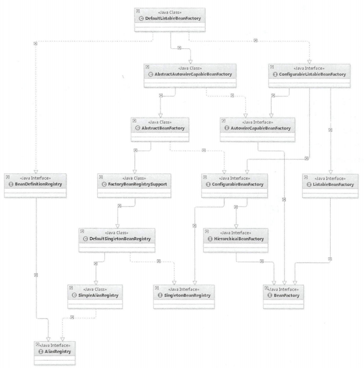

#1.各种小问题
##1.1BeanDefinition的注册过程
1.定位: 定位要加载的class文件

2.加载: 使用BeanDefinitionReader读取配置类,BeanDefinitionSacnner扫描配置类,确定哪些bean需要加载

3.注册: 将Class文件转换成BeanDefinition,通过BeanDefinitionRegistry进行注册BeanDefinition

**注: 在转换成BeanDefinition后有扩展点2个扩展点,可以对BeanDefinition进行修改和注册,分别是:BeanFactoryPostProcessor和BeanDefinitionRegistryPostProcessor, 在读取BeanDefinition的时候有个DefaultBeanDefinitionDocumentReader,里面的doRegisterBeanDefinitions方法中也有2个扩展点,分别是PreProcessXml和PostProcessXml,不过这2个都是针对xml文件的读取才有的.**

##1.2Bean的创建过程
1.注册BeanDefinition

2.调用BeanFactory.getBean("beanname")

3.实例化bean(实例化可以通过反射/简单工厂, 此处是使用的反射,相比反射,工厂来的更为灵活,工厂里也可以使用反射,也可以使用new)

4.属性填充

5.初始化

6.放入缓存池

**注: 在实例化bean前后都有BeanPostProcessor进行扩展, 而AOP是在初始化步骤之后才通过BeanPostProcessor进行扩展的.**

**具体代码步骤参考: springSource.md 文件**

#2容器的基本实现
##2.1容器的基本用法
spring的目的就是让bean成为一个纯粹的pojo
###2.4.2核心类介绍
**DefaultlistableBeanFactory**
DefaultListableBeanFactmy 是整个 bean加载的核心部分，是 Spring 注册及加载bean 的默认实现，而对于 XmlBeanFactory
DefaultListableBeanFactory 同的地方其实是在 XmlBeanFactory 中使用了自定义的 XML 读取器XmlBeanDefinitionReader ，实现了个性化的 BeanDefinitionReader 读取， DefaultListableBeanFactory 继承了 AbstractAutowireCapableBeanFactory 并实现了 ConfigurableListableBeanFactoy以及BeanDefinitionRegistry 接口

SingletonBeanRegistry ：定义对羊例的注册及获取

BeanDefinitionRegistry 定义对 BeanDefinition 的各种增删改操作

FactoryBeanReg stryS upport ：在 DefaultSingletonBeanRegist 基础上增加了对 FactoryBean的特殊处理功能

BeanFactory ：定义获取 bean及bean 的各种属性

HierarchicalBeanFactory ：继承 BeanFactory ，也就是在 BeanFactory 定义的功能的基础 上增加了对 parentFactory 支持

ConfigurableBeanFactory ：提供配直 Factory 的各种方法

ListableBeanFactory ：根据各种条件获取 bean 的配直清单

AbstractBeanFactory ：综合 FactoryBeanRegistrySupport ConfigurableBeanFactory
功能

AutowireCapableBeanFactory ：提供创 bean 、自动注入、初始化以及应用 an 的后
处理器

AbstractAutowireCapab eBeanFactory ：综合 bstractBeanF acto1y 并对接口 Autowire Capable
BeanFactory 进行实现

ConfigurableListableBeanFactory : Beanfacto 配直清单，指定忽略类型及接口等

DefaultListableBeanFactory 综合上面所有功能， 要是对 bean 注册后的处理

###spring文件的读取接口Resource介绍

UrlResource：访问网络资源的实现类。

ClassPathResource：访问类加载路径里资源的实现类。

FileSystemResource：访问文件系统里资源的实现类。

ServletContextResource：访问相对于ServletContext 路径里的资源的实现类.

InputStreamResource：访问输入流资源的实现类。

ByteArrayResource：访问字节数组资源的实现类。

##零散知识点
ConfigReader: 用于读取及验证配置文件

