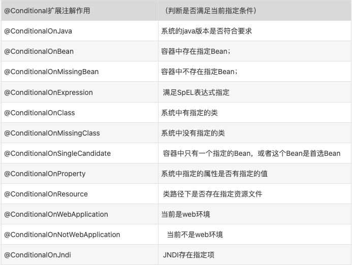

[启动过程](https://mp.weixin.qq.com/s?__biz=MzUwOTk1MTE5NQ==&mid=2247483664&idx=1&sn=4c384c9f1f49c9a3e4a481bceeba012b&chksm=f90b2ca4ce7ca5b2c1762e526c8bd0f34fd387552e182f3fa480386ad57e1cf3980d189e8b3d&token=302932053&lang=zh_CN&scene=21#wechat_redirect)

1.从spring的IOC到SpringBoot的自动配置原理
2.DefferedImportSelector对Bean加载顺序的影响
    
    DefferedImportSelector简介:主要是延迟和分组特性
        DeferredImportSelector是ImportSelector的一个扩展;
        ImportSelector实例的selectImports方法的执行时机，是在@Configguration注解中的其他逻辑被处理之前，所谓的其他逻辑，包括对@ImportResource、@Bean这些注解的处理（注意，这里只是对@Bean修饰的方法的处理，并不是立即调用@Bean修饰的方法，这个区别很重要！）;
        DeferredImportSelector实例的selectImports方法的执行时机，是在@Configguration注解中的其他逻辑被处理完毕之后，所谓的其他逻辑，包括对@ImportResource、@Bean这些注解的处理;
        DeferredImportSelector的实现类可以用Order注解，或者实现Ordered接口来对selectImports的执行顺序排序,如果实现了getImportGroup方法,则排序时是组内排序.

    DefferedImportSelector分组:
        当一个类实现DefferedImportSelector接口需要实现方法selectImports 和 getImportGroup方法, 其中getImportGroup方法是个default方法,
        在spring解析的时候会判断,实现类如果重写了这个方法,则对重写方法里的最后return的class类(这个类要实现DeferredImportSelector.Group接口)进行处理, 会调用其process方法,最终处理其中的selectImports方法,将方法返回的classname集合注册成bean定义
        如果实现类没有重写这个方法,则调用其中的会调用其process方法,将类中的selectImports方法返回的classname数组注册成bean定义

    springboot中DefferedImportSelector的使用:
        springboot集成其他bean使用了DeffredImportSelector延迟加载, spring是解析了@Bean,@Import,@Component等注解后才会去解析DeffredImportSelector,
        springboot管理的bean肯定非常多,不可能代码里写死了,所以就定义了spring.factories文件,而在DeffredImportSelector会去扫描所有jar包下的spring.factories文件
        然后将里面配置的类注册成bean定义, 如果这里面的类是自动配置相关的类,那么该类中肯定有很多@Bean的配置, 上面一般都会有@Conditional相关的注解,所以才能控制到底注入哪些bean
        具体如何控制,参考下方的"4.如何在自动配置类上进行定制扩展"

3.SpringBoot自动配置源码深入解析
    
    从@SpringBootApplication入手,该注解上面有个@EnableAutoConfiguration注解,注解里有个@Import(AutoConfigurationImportSelector.class),点开AutoConfigurationImportSelector
    AutoConfigurationImportSelector implements DeferredImportSelector 
    重写了getImportGroup()方法,返回了AutoConfigurationGroup.class,查看其process方法
        getAutoConfigurationEntry(annotationMetadata);//加载所有的有效的自动配置类
            getCandidateConfigurations(annotationMetadata, attributes);
                SpringFactoriesLoader.loadFactoryNames(getSpringFactoriesLoaderFactoryClass(), getBeanClassLoader())//获取所有的配置类
                    其中getSpringFactoriesLoaderFactoryClass()返回的是EnableAutoConfiguration.class, 以EnableAutoConfiguration过滤所有的自动配置类,
                    loadFactoryNames里面调用了forDefaultResourceLocation(classLoader).loadFactoryNames(factoryType);
                        其中forDefaultResourceLocation调用了forResourceLocation(classLoader, FACTORIES_RESOURCE_LOCATION);
                            而FACTORIES_RESOURCE_LOCATION = "META-INF/spring.factories";也就是这一步会读取所有jar包中和类路径中的spring.factories文件
                        其中loadFactoryNames调用了factories.getOrDefault(factoryType.getName(), Collections.emptyList());
                            就是根据EnableAutoConfiguration
            移除被排除掉的exclusions
            getConfigurationClassFilter().filter(configurations);//根据pom依赖中添加的starter,过滤出有效配置类
            
    而Group.selectImports方法主要作用是将自动配置类进行排序,根据@Order, @AutoConfigureBefore, @AutoConfigureAfter排序
    

4.如何在自动配置类上进行定制扩展

    不同的配置类使用的不同方式,
        1.ConditionOnBean,这种直接@Bean配置一个bean就行了
        2.ConditionOnProperty, 根据全局配置文件,这种就配置文件里关闭掉,然后@Bean写自己的
        
    自动配置原理解释: 以HttpEncodingAutoConfiguration（Http编码自动配置）
        @Configuration(proxyBeanMethods = false) //标记了@Configuration Spring底层会给配置创建cglib动态代理。作用：就是防止每次调用本类的Bean方法而重新创建对象，Bean是默认单例的
        @EnableConfigurationProperties(ServerProperties.class)//启用可以在配置类设置的属性 对应的类
            将配置文件中对应的值和 ServerProperties绑定起来；并把 ServerProperties加入到 IOC 容器中。并注册ConfigurationPropertiesBindingPostProcessor用于将@ConfigurationProperties的类和配置进行绑定
            ServerProperties通过 @ConfigurationProperties 注解将配置文件与自身属性绑定。
            对于@ConfigurationProperties注解小伙伴们应该知道吧，我们如何获取全局配置文件的属性中用到，它的作用就是把全局配置文件中的值绑定到实体类JavaBean上面（将配置文件中的值与ServerProperites绑定起来），而@EnableConfigurationProperties主要是把以绑定值JavaBean加入到spring容器中。
            到这里，小伙伴们应该明白，在application.properties 声明spring.application.name 是通过@ConfigurationProperties注解，绑定到对应的XxxxProperties配置实体类上，然后再通过@EnableConfigurationProperties注解导入到Spring容器中.
        @ConditionalOnWebApplication(type = ConditionalOnWebApplication.Type.SERVLET)//判断当前应用是否是web应用，如果是，当前配置类生效。
        @ConditionalOnClass(CharacterEncodingFilter.class)//判断当前项目有没有这个类CharacterEncodingFilter；SpringMVC中进行乱码解决的过滤器。
        @ConditionalOnProperty(prefix = "server.servlet.encoding", value = "enabled", matchIfMissing = true)//判断配置文件中是否存在配置spring.http.encoding.enabled；如果配置不存在，判断也是成立的
        public  class  HttpEncodingAutoConfiguration {
            private final Encoding properties;
            public HttpEncodingAutoConfiguration(ServerProperties properties) {
                this.properties = properties.getServlet().getEncoding();
            }
            @Bean
            @ConditionalOnMissingBean
            public CharacterEncodingFilter characterEncodingFilter() {
                CharacterEncodingFilter filter = new OrderedCharacterEncodingFilter();
                filter.setEncoding(this.properties.getCharset().name());
                filter.setForceRequestEncoding(this.properties.shouldForce(Encoding.Type.REQUEST));
                filter.setForceResponseEncoding(this.properties.shouldForce(Encoding.Type.RESPONSE));
                return filter;
            }
        }
    

5.实现自定义Starter完成自动配置
    
6.爆红问题
    
7.spring解析bean的顺序:由高到低
    @Component
    @Configuration
    @Bean
    @Import

8.springboot中是怎么开启webmvc的,也就是说RequestMappingHandlerMapping / RequestMappingHandlerAdapter等这些是在哪里进行初始化的
  或者说@EnableWebMvc在哪里被调用的.亦或者DelegatingWebMvcConfiguration.class是在哪里被import的,又或者是有类实现了WebMvcConfigurationSupport?
  
9.@Conditional派生注解

    Spring注解版原生的@Conditional作用: @xxxConditional根据当前不同的条件判断，决定这个配置类是否生效,必须是@Conditional指定的条件成立，才给容器中添加组件

    我们怎么知道哪些自动配置类生效；
    我们可以通过设置配置文件中：启用 debug=true属性；来让控制台打印自动配置报告，这样我们就可以很方便的知道哪些自动配置类生效；
    ============================
    CONDITIONS EVALUATION REPORT
    ============================
    Positive matches:---**表示自动配置类启用的**
    -----------------
    ...省略...
    Negative matches:---**没有匹配成功的自动配置类**
    -----------------
    ...省略...

spi是属于springboot启动原理里面的

