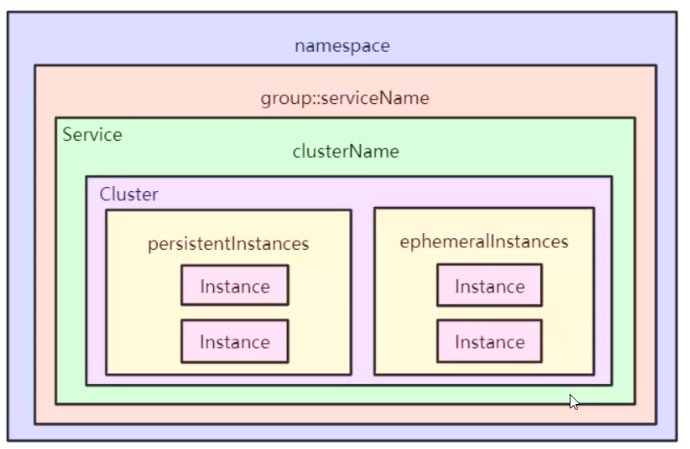

注册instance是存储在哪里?
    
    临时节点存储在内存中,持久化节点持久化到磁盘文件 data/naming/namespace的id
配置数据是什么存储的?
    
    内置数据库derby,也可以切换成mysql

configservice类对应了配置,NamingService类是一个核心类,注册实例拉取实例等等,都是这个类的方法

注册实例可以看InstanceController类

    register 方法是注册接口,里面写了内存注册表,
        有个重要接口是Service,对应的就是一个微服务
            Map<namespace,Map<group::serviceName,Service>>
            通过namespace(隔离作用)找到微服务, 微服务又分组(常用于配置中心,比如测试环境,开发环境)
            不同的namespace,不同的group的服务之间是调用不通的
            Map<String,Cluster> clusterMap  集群,不论clustername一样不一样,集群之间是互通的,都能互相调用. 为了性能着想,最好是使用同一个集群名称,比如北京有一个集群,上海有一个集群
    beat 方法是心跳
    list 方法是拉取服务列表

实例结构图

NacosServiceRegistry#register的方法是实际调用nameservice#registerInstance

Nacos是如何实现自动注册的?

    依赖链路: Nacos ->spring cloud Alibaba Nacos -> springcloud -> springboot -> spring
    NacosNamingService#registerInstance 是注册实例的,那么这个方法是如何被调用的呢?
        NacosServiceRegistry#register调用了NacosNamingService#registerInstance
        而NacosServiceRegistry是ServiceRegistry的实现, 先介绍ServiceRegistry#register, 是springcloud的一个服务注册的接口标准,
        AbstractAutoServiceRegistration实现了ApplicationListener<WebServerInitializedEvent>,即在WebServerInitializedEvent事件被发布的时候,会在onApplicationEvent中调用注册NacosServiceRegistry#register
        NacosAutoServiceRegistration是AbstractAutoServiceRegistration的实现
        到这里就有一个问题了,WebServerInitializedEvent是什么时候被发布的呢? 在ServletWebServerApplicationContext中,tomcat启动之后会调用ServletWebServerApplicationContext#finishRefresh(),
            里面调用了publishEvent(new ServletWebServerInitializedEvent(webServer, this));  而ServletWebServerInitializedEvent就是WebServerInitializedEvent的子类
    总结:也就是说容器启动之后会发布WebServerInitializedEvent事件,从而触发AbstractAutoServiceRegistration#onApplicationEvent接口,该接口会调用NacosServiceRegistry#register进行自动注册服务.
    关于这里有个blog可以参考 https://blog.csdn.net/he702170585/article/details/107061542/

Nacos核心功能源码架构图

nacos服务注册与发现,源码解析

nacos注册表如何防止多节点读写并发冲突

nacos高并发支撑异步任务与内存队列剖析

nacos心跳机制与服务健康检查源码剖析

nacos服务变动事件发布源码剖析

nacos服务下线源码深度剖析

nacos心跳在集群架构下的设计原理剖析

nacos集群节点状态同步源码剖析

nacos集群服务新增数据同步源码剖析

nacos集群服务状态变动同步源码剖析

    1.动态刷新client是如何感知的
    2.多个配置,优先级是怎样的
    3.集群节点是如何同步配置的

看源码的方式:

    找入口,记录核心接口,核心方法

springboot加载配置: 

    sping提供了PropertySource文件,然后springboot提供了propertySourceLoader接口,里面有各种实现,
    比如PropertiespropertySourceLoader和YamlpropertySourceLoader

    优先级的高低: 从高到低
        ${spring.application.name}-${profile}.${file-extension:properties}
        ${spring.application.name}.${file-extension:properties}
        ${spring.application.name}
        extensionConfigs
        sharedConfigs
nacos配置中心源码分析

nacos的配置功能

    环境配置:根据不同的环境取不同的配置
    共享配置:不同工程的公用的配置,可以单独拉出来,配置到共享配置里, 支持dataid
    扩展配置:支持一个应用多个dataid的配置, 比如nacos.yml  mybatis.yml
    代码在NacosConfigProperties.java类中

