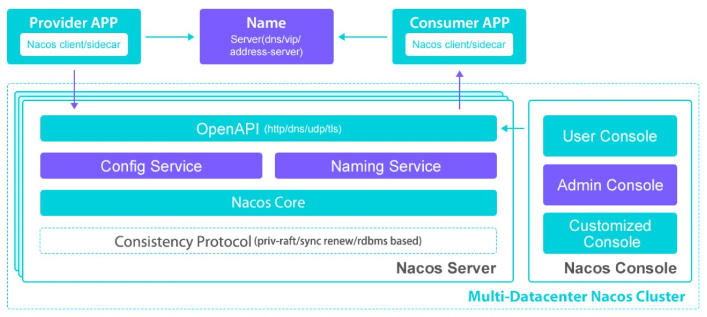
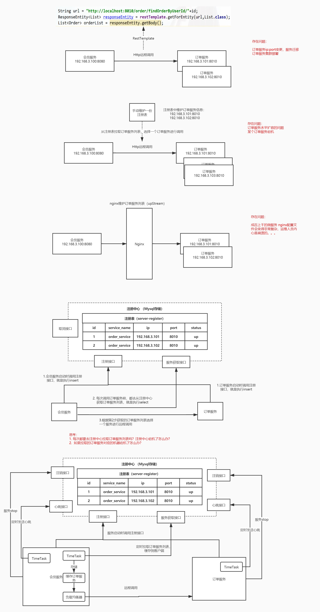
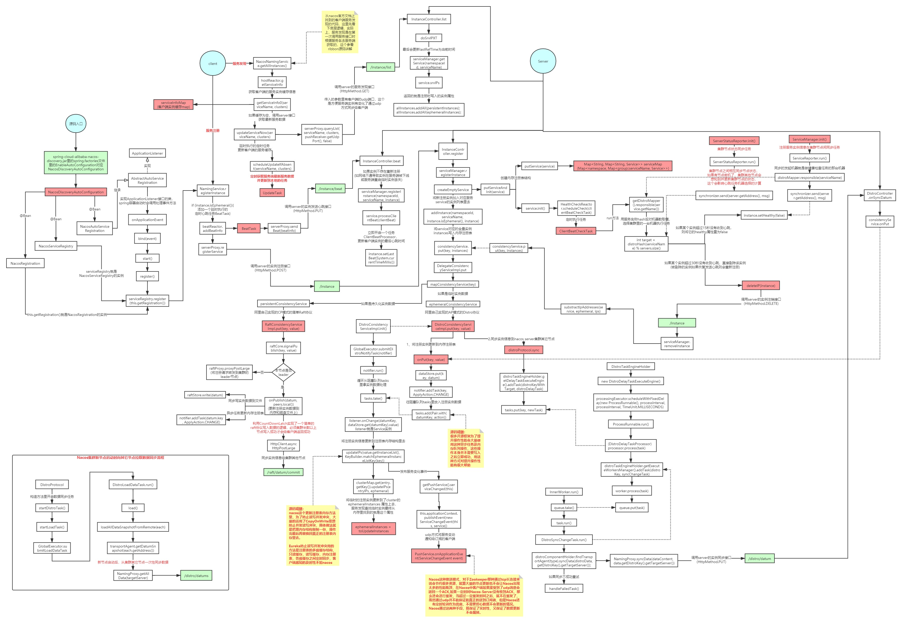
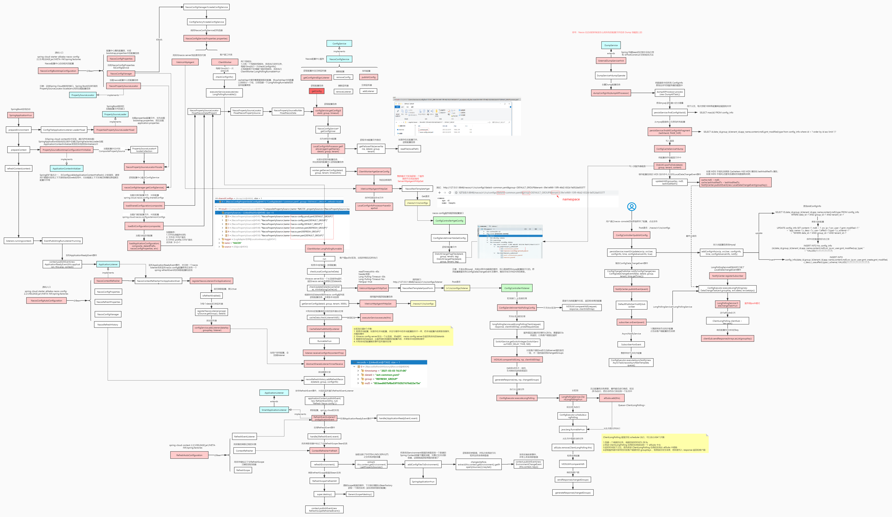
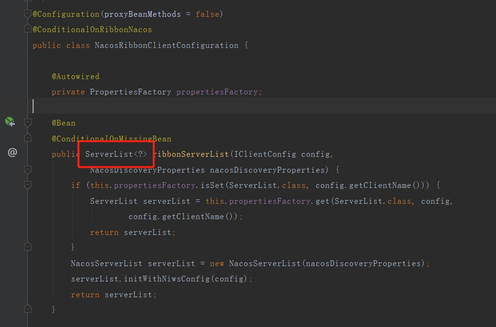

[Nacos注册中心原理及核心源码分析](https://zhuanlan.zhihu.com/p/432534729)

nacos架构

NamingService: 命名服务，是nacos提供用来实现服务注册、服务订阅、服务发现等功能的api，由NacosNamingService唯一实现，通过这个api就可以跟nacos服务端实现通信。

ConfigService：配置服务，配置中心核心接口

注册中心演变

注册中心的一般设计

    增(注册->服务启动注册)
    删(服务停止)
    改(服务端定时检查心跳默认15s改状态,30s删除->客户端定时任务发送心跳,默认5s)
    查(定时拉取服务-缓存本地)
    集群节点上线
    集群节点下线
    集群节点同步: leader raft

实例结构图

    namespace: 命名空间,用来服务隔离,比如说商城系统和OA系统, 他俩完全没啥关系, 但是OA系统没必要单独一套nacos, 那么就可以用namespace来隔离,再比如生产环境和开发环境可以用不同的namespace
    group: 同一个namespace下,不同的group之间相互隔离,比如2个服务实例都叫serviceA,一个在groupDev,另一个groupTest,那么在groupDev的服务只能订阅groupDev服务的serviceA.
    cluster: 集群, 不同集群名称是可以互相订阅的,是互通的
    persistentInstances: 持久化服务
    ephemeralInstances: 临时服务
服务领域模型

Nacos与其他注册中心的区别:作为注册中心对外提供了增删改查节点的http接口,可以跨语言.

Nacos默认5秒向服务端发送一次心跳，如果15s内没收到心跳，则更新为不健康状态，30s内没收到心跳，则剔除该服务，如果是持久化节点则只会声明服务是否健康，不会剔除服务。

###nacos是如何进行服务注册的
注册实例可以看InstanceController类

    register 方法是注册接口,里面写了内存注册表,
        有个重要接口是Service,对应的就是一个微服务
            Map<namespace,Map<group::serviceName,Service>>
            通过namespace(隔离作用)找到微服务, 微服务又分组(常用于配置中心,比如测试环境,开发环境)
            不同的namespace,不同的group的服务之间是调用不通的
            Map<String,Cluster> clusterMap  集群,不论clustername一样不一样,集群之间是互通的,都能互相调用. 为了性能着想,最好是使用同一个集群名称,比如北京有一个集群,上海有一个集群
    beat 方法是心跳
    list 方法是拉取服务列表
    
[nacos是如何进行服务注册的](https://mp.weixin.qq.com/s?__biz=Mzg5MDczNDI0Nw==&mid=2247483763&idx=1&sn=78c2abadeb849203c5d50567f70c006f&chksm=cfd952bbf8aedbad23f3747c1a6ebf6f43a4a175fca057caeab1fd35b81630460e5b65103719&scene=21#wechat_redirect)

NacosServiceRegistry#register的方法是实际调用nameservice#registerInstance
    
    开启定时任务线程池,定时发送心跳http,到服务端, 当一个服务被服务端删除的时候,再次发送心跳,在服务端会找不到这个服务, 然后客户端会进行重新注册
    发送http请求到服务端,进行注册服务(注册之前先从服务端地址中随机选择一个进行调用,调用失败的话会再次选择一个进行重试,直至注册成功)

[nacos是如何整合springcloud](https://mp.weixin.qq.com/s?__biz=Mzg5MDczNDI0Nw==&mid=2247483806&idx=1&sn=e58729a71ce589347ce3f1f4d83c75d8&chksm=cfd95256f8aedb40eb6cad8d456feeea062a3f9d6b53cf48e63c91dd387cfe9075f4d7a0341f&scene=21#wechat_redirect)

Nacos是如何实现自动注册的?
    
    容器启动之后会发布WebServerInitializedEvent事件,从而触发Spring-Cloud-Common中的AbstractAutoServiceRegistration#onApplicationEvent接口
        bind(event)
            start()
                register();
                    serviceRegistry.register
                        NacosServiceRegistry.register
                            NacosNamingService#registerInstance发送http请求到服务端进行注册
    
    总结:其实就是服务注册类监听了web容器初始化事件，然后调用的服务注册接口
        容器启动,发布WebServerInitializedEvent事件(当Webserver初始化完成之后), AbstractAutoServiceRegistration监听了该事件,会在onApplicationEvent中调用注册NacosServiceRegistry#register,该接口会调用NacosServiceRegistry#register进行自动注册服务.
    
    依赖链路: Nacos ->spring cloud Alibaba Nacos -> springcloud -> springboot -> spring
    NacosNamingService#registerInstance 是注册实例的,那么这个方法是如何被调用的呢?
        NacosServiceRegistry#register调用了NacosNamingService#registerInstance
        而NacosServiceRegistry是ServiceRegistry的实现, 先介绍ServiceRegistry#register, 是springcloud的一个服务注册的接口标准,
        AbstractAutoServiceRegistration实现了ApplicationListener<WebServerInitializedEvent>,即在WebServerInitializedEvent事件被发布的时候,会在onApplicationEvent中调用注册NacosServiceRegistry#register
        NacosAutoServiceRegistration是AbstractAutoServiceRegistration的实现
        到这里就有一个问题了,WebServerInitializedEvent是什么时候被发布的呢? 在ServletWebServerApplicationContext中,tomcat启动之后会调用ServletWebServerApplicationContext#finishRefresh(),
            里面调用了publishEvent(new ServletWebServerInitializedEvent(webServer, this));  而ServletWebServerInitializedEvent就是WebServerInitializedEvent的子类
    关于这里有个blog可以参考 https://blog.csdn.net/he702170585/article/details/107061542/    https://zhuanlan.zhihu.com/p/486073668
    
SpringCloud完成注册的时机

    在Spring-Cloud-Common包中有一个类org.springframework.cloud.client.serviceregistry.ServiceRegistry ,
    它是Spring Cloud提供的服务注册的标准。集成到Spring Cloud中实现服务注册的组件,都会实现该接口。在Nacos中的实现是NacoServiceRegistry。
    SpringCloud集成Nacos的实现过程：在spring-cloud-commons包的META-INF/spring.factories中包含自动装配的配置信息如下：
        org.springframework.boot.autoconfigure.EnableAutoConfiguration=org.springframework.cloud.client.serviceregistry.AutoServiceRegistrationAutoConfiguration
        而AutoServiceRegistrationAutoConfiguration就是服务注册相关的配置类,里面注入了一个AutoServiceRegistration实例,AbstractAutoServiceRegistration抽象类实现了该接口,
        并且NacosAutoServiceRegistration继承了AbstractAutoServiceRegistration。AbstractAutoServiceRegistration又实现了EventListener,监听WebServerInitializedEvent事件(当Webserver初始化完成之后)
springcloud服务自动注册的三大组件

    ServiceRegistry：服务注册接口，通过这个api直接可以向服务注册中心注册
    Registration：服务实例的数据的封装，提供获取包括ip、端口之类的服务基本信息的方法
    AbstractAutoServiceRegistration：自动注册类，这个类监听了WebServerInitializedEvent事件，容器启动的时候，会发布这个事件，然后触发自动注册
    
注册instance是存储在哪里?
    
    临时节点存储在内存中,持久化节点持久化到磁盘文件 data/naming/namespace的id
配置数据是什么存储的?
    
    内置数据库derby,也可以切换成mysql
    
Nacos核心功能源码架构图

nacos注册表如何防止多节点读写并发冲突?

    CopyOnWrite 思想
    在updateIps方法中传入了一个List<Instance> ips，然后用ips跟之前注册表中的Instances进行比较，分别得出需要添加、更新、和删除的实例，然后做
    一些相关的操作，比如Instance的一些属性设置、启动心跳、删除心跳等等，最后把处理后的List<Instance> ips，直接替换内存注册表，这样如果同时有读
    的请求，其实读取是之前的老注册表的信息，这样就很好的控制了并发读写冲突问题，这个思想就是Copy On Write思想，在JDK源码中并发包里也有一些相关的
    实现，比如：CopyOnWriteArrayList
    参考:https://blog.csdn.net/louis_zzz/article/details/121061589   源代码在com.alibaba.nacos.naming.core.Cluster#updateIps

nacos高并发支撑异步任务与内存队列剖析

nacos服务变动事件发布源码剖析

    nacos在启动时, 会将数据库的配置数据写入到磁盘文件,DumpService是将数据库中的数据,写入到磁盘
    服务端的getconfig接口是直接从本地磁盘缓存文件中读取的,并非是从数据库读取的,所以如果是修改了数据库,然后调用getconfig接口,那么数据是没有变的.
    如果想让其生效, 那么服务端一定要发布ConfigDataChageEvent事件,出发本地文件和内存的更新

nacos服务下线源码深度剖析

nacos心跳在集群架构下的设计原理剖析

nacos集群节点状态同步源码剖析

nacos集群服务新增数据同步源码剖析

nacos集群服务状态变动同步源码剖析

    1.动态刷新client是如何感知的
    2.多个配置,优先级是怎样的
    3.集群节点是如何同步配置的

看源码的方式: 找入口,记录核心接口,核心方法

nacos配置中心源码分析

springboot加载配置的顺序: 

    sping提供了PropertySource文件,然后springboot提供了propertySourceLoader接口,里面有各种实现,
    比如PropertiespropertySourceLoader和YamlpropertySourceLoader
    优先级的高低: 从高到低
        ${spring.application.name}-${profile}.${file-extension:properties}
        ${spring.application.name}.${file-extension:properties}
        ${spring.application.name}
        extensionConfigs
        sharedConfigs

nacos的配置功能

    环境配置:根据不同的环境取不同的配置
    共享配置:不同工程的公用的配置,可以单独拉出来,配置到共享配置里, 支持dataid
    扩展配置:支持一个应用多个dataid的配置, 比如nacos.yml  mybatis.yml
    代码在NacosConfigProperties.java类中

    在springboot加载配置文件中(启动过程中调用的prepareEnvironment方法中)会调用PropertySourceLocator去加载文件,而nacos实现了PropertySourceLocator接口,
    在NacosPropertySourceLocator#locateCollection中加载了nacos的配置,调用顺序如下: 后加载的会覆盖先加载的.
        loadSharedConfiguration();
        loadExtConfiguration();
        loadApplicationConfiguration();
            文件名(微服务名)
            文件名.文件扩展名
            文件名-profile.文件扩展名

配置中心看:

    启动时怎么注册的
    更新操作  有个notifycenter#publishEvent是发布配置变更的
    删除操作
    集群怎么同步的
    扩展点,多看源码,看看扩展点都怎么使用的

其他参考blog

[nacos2.0,性能提高10倍](https://www.cnblogs.com/whgk/p/14616247.html)

nacos整合ribbon实现:ribbon是负载均衡的组件，负载均衡，得有服务列表，而nocos刚好提供的有查询服务列表的api,通过nacos提供的api，就可以从nacos服务端拉取服务注册表，那么nacos是如何整合ribbon的呢？

    ribbon提供了一个接口ServerList，ribbon会通过这个接口获取服务数据，里面有两个获取服务实例的方法,nacos就是通过实现这个接口来实现整合ribbon的。
    在Nacos中NacosServerList<NacosServer>实现了ServerList<Server>接口, 实现其实很简单，就是通过nacos提供的api NamingService来实现获取服务实例，然后转换成ribbon认识的NacosServer。
    然后注入一个ServerList对象就可以了,代码是在NacosRibbonClientConfiguration中

nacos整合ribbon实现的个人思考

    其实ribbon在整合springcloud的实现在获取服务数据的整合方式我其实是持保留意见的。因为ribbon并没有实现通过springcloud提供的api来获取服务列表，
    而是需要第三方注册中心来主动适配ribbon，这就使得springcloud失去了约束的意义。就类似mybatis一样，mybatis依靠jdbc，但是mybatis根本不关心哪
    个数据库实现的jdbc。其实ribbon完全可以通过springcloud的api（DiscoveryClient）来实现从获取列表，这样注册中心主要去适配这个接口，而不需要直
    接适配ribbon。
    
    DiscoveryClient其实就是springcloud提供的一个接口，用来获取服务实例的，需要各自注册中心实现，nacos的实现是NacosDiscoveryClient，实现也跟
    上面整合ribbon的差不多。
        

