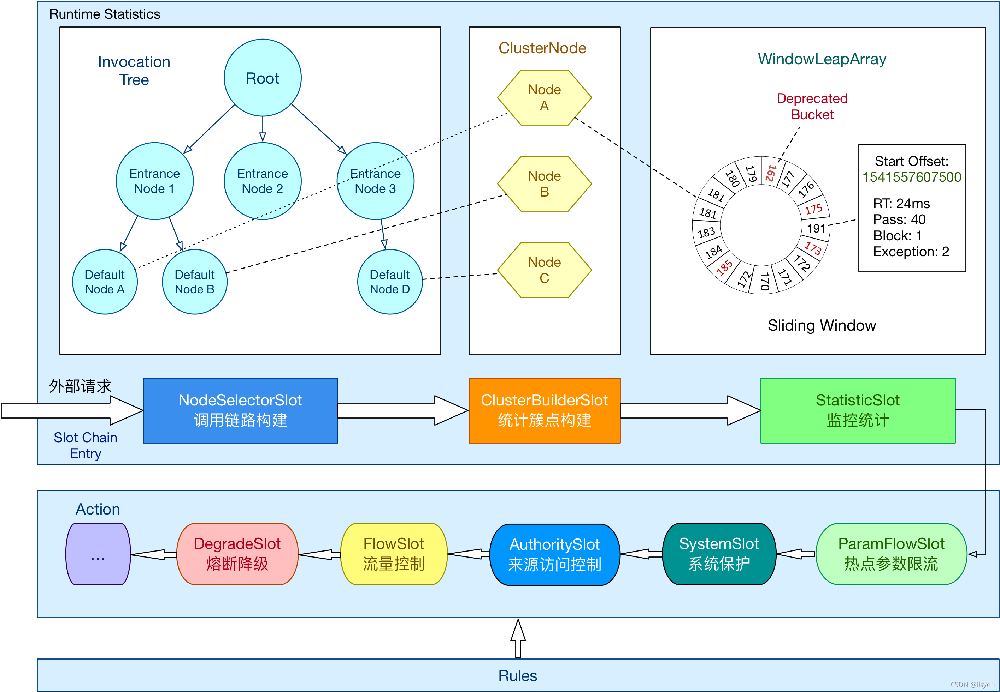
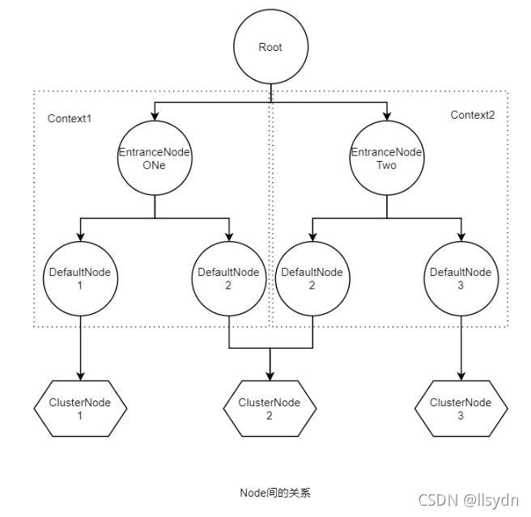
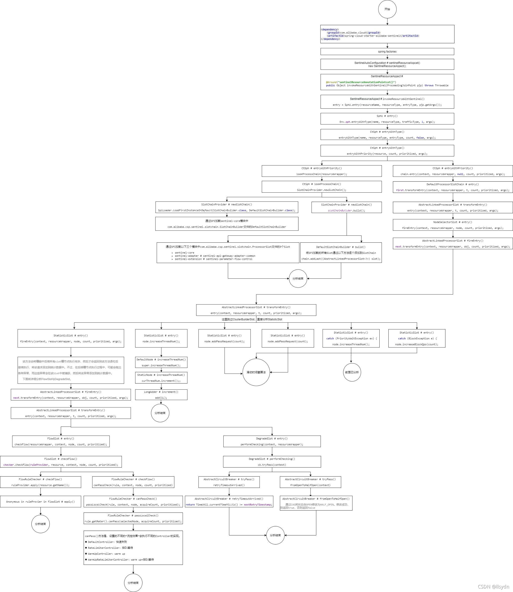
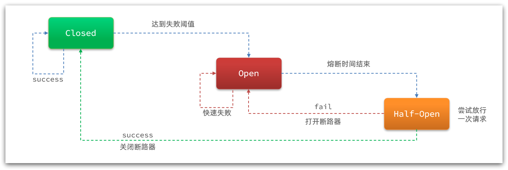
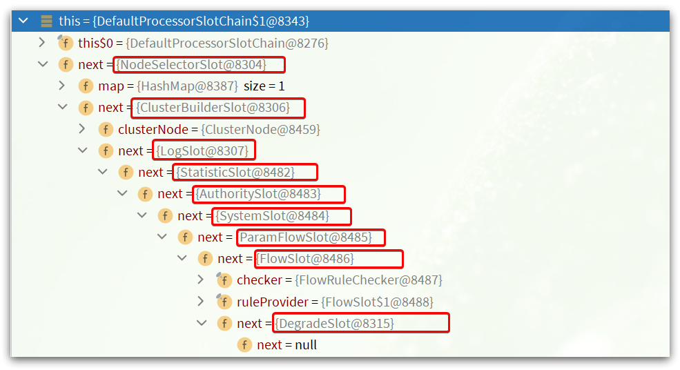
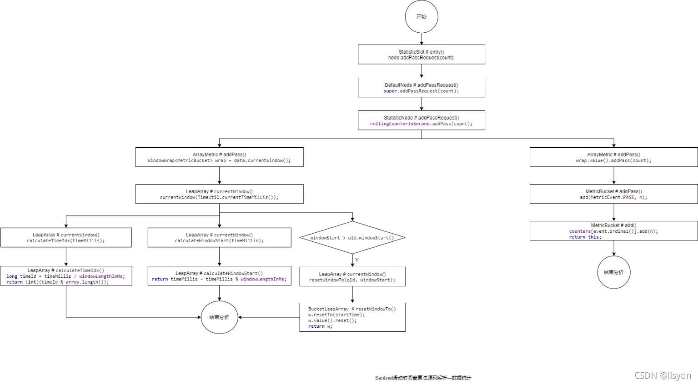
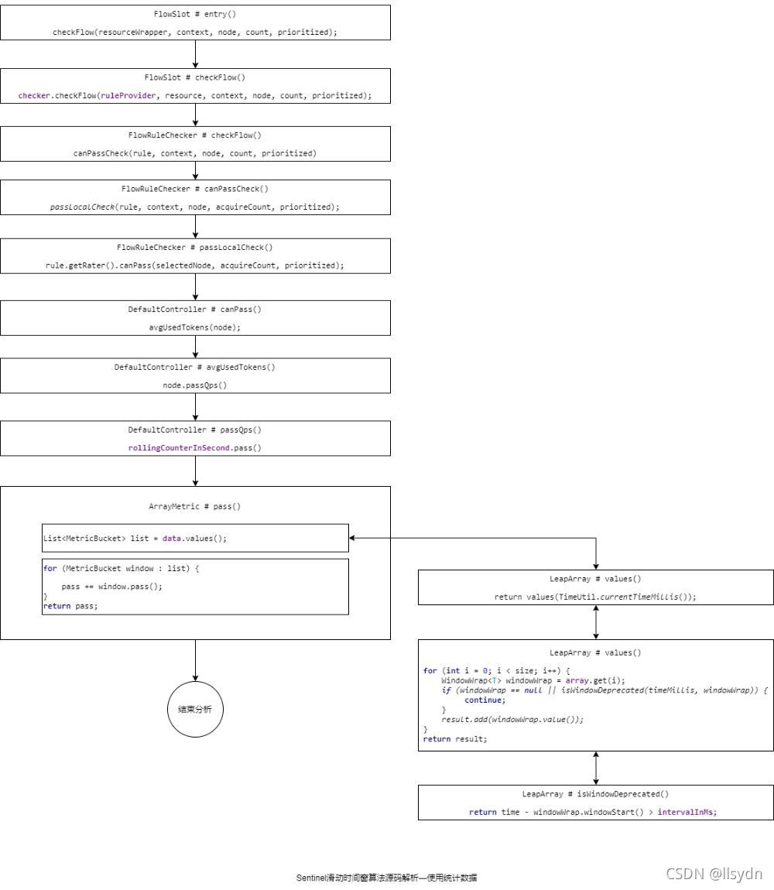
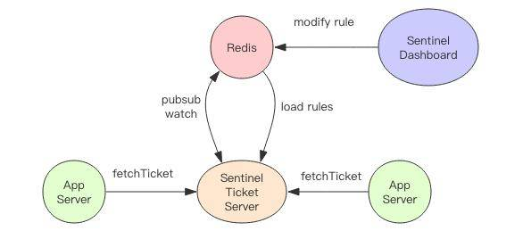
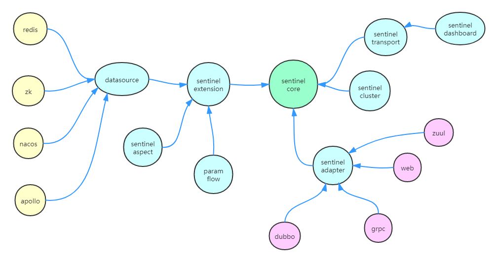

[官方文档](https://github.com/alibaba/Sentinel/wiki/)

[深入理解 Sentinel 中的限流算法](https://zhuanlan.zhihu.com/p/383064126)

Sentinel功能:

    流量控制、熔断降级、系统负载保护等多个维度保护服务的稳定性。与其他模块的整合只需要引入相应的依赖并进行简单的配置即可快速地接入 Sentinel。
    完善的 SPI 扩展点：Sentinel 提供简单易用、完善的 SPI 扩展接口。您可以通过实现扩展接口来快速地定制逻辑。例如定制规则管理、适配动态数据源等。
    本质要做的就是两件事情:
        统计数据：统计某个资源的访问数据（QPS、RT等信息）
        规则判断：判断限流规则、隔离规则、降级规则、熔断规则是否满足

主要特性：

Sentinel 分为两个部分：

    核心库（Java 客户端）：不依赖任何框架/库，能够运行于所有 Java 运行时环境，同时对 Dubbo / Spring Cloud 等框架也有较好的支持。
    控制台（Dashboard）：基于 Spring Boot 开发，打包后可以直接运行，不需要额外的 Tomcat 等应用容器。

ProcessorSlotChain:ProcessorSlotChain这个类基于责任链模式来设计，将不同的功能（限流、降级、系统保护）封装为一个个的Slot，请求进入后逐个执行即可。

ProcessorSlotChain其工作流如图：

SPI机制:Sentinel槽链中各Slot的执行顺序是固定好的。但并不是绝对不能改变的。Sentinel将ProcessorSlot 作为 SPI 接口进行扩展，使得 SlotChain 具备了扩展能力。用户可以自定义Slot并编排Slot 间的顺序。

Slot简介:

    统计数据构建部分（statistic）
        NodeSelectorSlot:负责收集资源的路径，并将这些资源的调用路径，以树状结构存储起来，用于根据调用路径来限流降。原来如此,是根据节点限流的
        ClusterBuilderSlot:用于存储资源的统计信息以及调用者信息，例如该资源的 RT, QPS, thread count，Block count，Exception count 等等，这些信息将用作为多维度限流，降级的依据。简单来说，就是用于构建ClusterNode。
        StatisticSlot:监控统计，用于记录、统计不同纬度的 runtime 指标监控信息。
    规则判断部分（rule checking）    
        ParamFlowSlot:对应热点流控。
        SystemSlot:系统保护,通过系统的状态，例如 load1 等，来控制总的入口流量。对应系统规则。
        AuthoritySlot:来源访问控制,根据配置的黑白名单和调用来源信息，来做黑白名单控制。对应授权规则。
        FlowSlot:流量控制,用于根据预设的限流规则以及前面 slot 统计的状态，来进行流量控制。对应流控规则。
        DegradeSlot:熔断降级,通过统计信息以及预设的规则，来做熔断降级。对应降级规则。
        

Context简介:

    Context 代表调用链路上下文，贯穿一次调用链路中的所有资源（ Entry），基于ThreadLocal。
    Context 维持着入口节点（entranceNode）、本次调用链路的 curNode（当前资源节点）、调用来源（origin）等信息。后续的Slot都可以通过Context拿到DefaultNode或者ClusterNode，从而获取统计数据，完成规则判断
    Context初始化的过程中，会创建EntranceNode(入口节点)，contextName就是EntranceNode的名称
    创建: ContextUtil.enter("contextName", "originName");//创建context，包含两个参数：context名称、 来源名称

Node:Sentinel中的簇点链路是由一个个的Node组成的，Node是一个接口，包括下面的实现：

    所有的节点都可以记录对资源的访问统计数据，所以都是StatisticNode的子类。
    按照作用分为两类Node：
        DefaultNode：代表链路树中的每一个资源，一个资源出现在不同链路中时，会创建不同的DefaultNode节点。而树的入口节点叫EntranceNode，是一种特殊的DefaultNode,根据路径限制
            EntranceNode：入口节点，一个Context会有一个入口节点，用于统计当前Context的总体流量数据        
        ClusterNode：代表资源，一个资源不管出现在多少链路中，只会有一个ClusterNode。记录的是当前资源被访问的所有统计数据之和。根据资源限制
    节点访问示例:例如在一个SpringMVC项目中，有两个业务：
        业务1：controller中的资源/order/query访问了service中的资源/goods
        业务2：controller中的资源/order/save访问了service中的资源/goods

Sentinel中被保护的资源,Sentinel中的资源用Entry来表示。
    
    编程方式自定义资源:
        // 资源名可使用任意有业务语义的字符串，比如方法名、接口名或其它可唯一标识的字符串。
        try (Entry entry = SphU.entry("resourceName")) {
            // 被保护的业务逻辑
            // do something here...
        } catch (BlockException ex) {
            // 资源访问阻止，被限流或被降级
            // 在此处进行相应的处理操作
        }
    编程方式自定义资源示例:
        1.引入Sentinel依赖
        2.伪代码: 通过下方代码就讲queryOrderById标记为了一个资源,名字为resource1
            public Order queryOrderById(Long orderId) {
                // 创建Entry，标记资源，资源名为resource1
                try (Entry entry = SphU.entry("resource1")) {
                    // 1.查询订单，这里是假数据
                    Order order = Order.build(101L, 4999L, "小米 MIX4", 1, 1L, null);
                    // 2.查询用户，基于Feign的远程调用
                    User user = userClient.findById(order.getUserId());
                    // 3.设置
                    order.setUser(user);
                    // 4.返回
                    return order;
                }catch (BlockException e){
                    log.error("被限流或降级", e);
                    return null;
                }
            }
    基于注解标记资源:给方法添加@SentinelResource注解即可.

源码解析:
    
    其实和hystrix差不多,都是根据注解搞AOP增强,@SentinelResource注解就是一个标记，Sentinel对被标记的方法做环绕增强，完成资源（Entry）的创建。
    
    spring.factories中引入了SentinelAutoConfiguration类,该类中注入了SentinelResourceAspect类
        //切点:标有@SentinelResource注解的
        @Pointcut("@annotation(com.alibaba.csp.sentinel.annotation.SentinelResource)")
        public void sentinelResourceAnnotationPointcut() { }

        //环绕增强
        @Around("sentinelResourceAnnotationPointcut()")
        public Object invokeResourceWithSentinel(ProceedingJoinPoint pjp) throws Throwable {
            Method originMethod = resolveMethod(pjp);
    
            SentinelResource annotation = originMethod.getAnnotation(SentinelResource.class);
            if (annotation == null) {
                // Should not go through here.
                throw new IllegalStateException("Wrong state for SentinelResource annotation");
            }
            String resourceName = getResourceName(annotation.value(), originMethod);
            EntryType entryType = annotation.entryType();
            int resourceType = annotation.resourceType();
            Entry entry = null;
            try {
                entry = SphU.entry(resourceName, resourceType, entryType, pjp.getArgs());
                return pjp.proceed();
            } catch (BlockException ex) {
                return handleBlockException(pjp, annotation, ex);
            } catch (Throwable ex) {
                Class<? extends Throwable>[] exceptionsToIgnore = annotation.exceptionsToIgnore();
                // The ignore list will be checked first.
                if (exceptionsToIgnore.length > 0 && exceptionBelongsTo(ex, exceptionsToIgnore)) {
                    throw ex;
                }
                if (exceptionBelongsTo(ex, annotation.exceptionsToTrace())) {
                    traceException(ex);
                    return handleFallback(pjp, annotation, ex);
                }
    
                // No fallback function can handle the exception, so throw it out.
                throw ex;
            } finally {
                if (entry != null) {
                    entry.exit(1, pjp.getArgs());
                }
            }
        }
核心源码解析

调用链路上下文Context的初始化

    spring.factories中注册了SentinelWebAutoConfiguration类,类中注入了以下bean:
        SentinelWebMvcConfigurer,该类实现了WebMvcConfigurer,而WebMvcConfigurer是SpringMVC自定义配置用到的类，可以配置HandlerInterceptor 
            SentinelWebMvcConfigurer#addInterceptors
                registry.addInterceptor(sentinelWebInterceptorOptional.get());//添加了SentinelWebInterceptor类型的拦截器
                //SentinelWebInterceptor extends AbstractSentinelInterceptor, AbstractSentinelInterceptor implements HandlerInterceptor
                //HandlerInterceptor拦截器会拦截一切进入controller的方法，执行preHandle前置拦截方法，而Context的初始化就是在这里完成的。
                实际是调用AbstractSentinelInterceptor#preHandle
                    String contextName = getContextName(request);// 获取 contextName，默认是sentinel_spring_web_context
                    ContextUtil.enter(contextName, origin);//创建调用链路上下文Context，参数为：入口节点 和 contextName
                        trueEnter(name, origin);//真正的创建
                            DefaultNode node = new EntranceNode(new StringResourceWrapper(name, EntryType.IN), null);//初始化入口节点
                            Context context = new Context(node, name);//创建上下文
                    Entry entry = SphU.entry(resourceName, ResourceTypeConstants.COMMON_WEB, EntryType.IN);
                    // 创建资源，名称就是当前请求的controller方法的映射路径,即每一个请求都会被视为一个资源.

请求调用执行过程,即ProcessorSlotChain执行流程.

    从拦截器AbstractSentinelInterceptor#preHandle开始
        SphU.entry(resourceName, ResourceTypeConstants.COMMON_WEB, EntryType.IN);
        //可以看到,不论是在 SentinelResourceAspect中的aop增强,AbstractSentinelInterceptor#preHandle,任何一个资源必定要执行SphU.entry()这个方法
            Env.sph.entryWithType(name, resourceType, trafficType, 1, args);//实际调用CtSph@entryWithType
                StringResourceWrapper resource = new StringResourceWrapper(name, entryType, resourceType);// 将资源名称等基本信息 封装为一个 StringResourceWrapper对象
                entryWithPriority(resource, count, prioritized, args);
                    ProcessorSlot<Object> chain = lookProcessChain(resourceWrapper);//获取 Slot执行链,实现类是DefaultProcessorSlotChain，同一个资源，会创建一个执行链，放入缓存,一个资源只会有一个ProcessorSlotChain.
                    Entry e = new CtEntry(resourceWrapper, chain, context);// 创建 Entry，并将 resource、chain、context 记录在 Entry中
                    chain.entry(context, resourceWrapper, null, count, prioritized, args);// 执行 slotChain,实际调用DefaultProcessorSlotChain#entry
                        first.transformEntry(context, resourceWrapper, t, count, prioritized, args);//first是AbstractLinkedProcessorSlot
                        按照责任链顺序，first应该就是 NodeSelectorSlot,
                            NodeSelectorSlot负责构建簇点链路中的节点（DefaultNode），将这些节点形成链路树。
                                为当前资源创建 DefaultNode,将DefaultNode放入缓存中，key是contextName，这样不同链路入口的请求，将会创建多个DefaultNode，相同链路则只有一个DefaultNode
                                将当前资源的DefaultNode设置为上一个资源的childNode,将当前资源的DefaultNode设置为Context中的curNode（当前节点）
                            下一个slot，就是 ClusterBuilderSlot
                                创建节点,用于存储资源的统计信息以及调用者信息
                            下一个slot，就是 StatisticSlot
                                StatisticSlot负责统计实时调用数据，包括运行信息（访问次数、线程数）、来源信息等。
                                StatisticSlot是实现限流的关键，其中基于滑动时间窗口算法维护了计数器，统计进入某个资源的请求次数。
                                这里是直接放行, 然后访问次数,线程数都+1, 来源计数器 ,全局计数器  +1
                                计数+1动作都包括两部分: 一个是当前链路的计数器+1, 一个是当前资源的总计数器+1
                            下一个slot，就是 AuthoritySlot: 负责授权规则（来源控制）
                                对请求进行黑名单或白名单的校验: 如果是校验黑名单,黑名单包含这个来源,则不通过; 如果校验白名单,白名单不包含则不通过;
                            下一个slot，就是 SystemSlot,是对系统保护的规则校验
                                对全局 QPS,全局 线程数,全局平均 RT,全局 系统负载,全局 CPU使用率进行校验
                            下一个slot，就是 ParamFlowSlot: 热点参数限流,比如/order/{orderid},可以对orderid的值进行限流,比如为1时2s内限流4次访问,2时5s内限流40次访问
                                热点规则判断采用了令牌桶算法来实现参数限流，为每一个不同参数值设置令牌桶，Sentinel的令牌桶有两部分组成：tokenCounters用来记录剩余令牌数量,timeCounters用来记录上一个请求的时间

                            下一个slot，就是 FlowSlot: 负责限流规则的判断
                                包括：
                                    三种流控模式：直接模式、关联模式、链路模式
                                    三种流控效果：快速失败、warm up、排队等待
                                三种流控模式，从底层数据统计角度，分为两类：
                                    对进入资源的所有请求（ClusterNode）做限流统计：直接模式、关联模式
                                    对进入资源的部分链路（DefaultNode）做限流统计：链路模式
                                三种流控效果，从限流算法来看，分为两类：
                                    滑动时间窗口算法：快速失败、warm up
                                    漏桶算法：排队等待效果
                            下一个slot，就是 DegradeSlot: 降级规则判断,Sentinel的降级是基于状态机来实现的：
                                请求经过所有插槽 后，一定会执行exit方法，而在DegradeSlot的exit方法中,会进行降级.

责任链顺序:责任链是执行Slot的entry方法

FlowSlot:滑动时间窗口算法
    
    滑动时间窗口的功能分两部分来看：
        一是时间区间窗口的QPS计数功能，这个是在StatisticSlot中调用的
        二是对滑动窗口内的时间区间窗口QPS累加，这个是在FlowRule中调用的
    在StatisticSlot#entry方法里会同时对DefaultNode和ClusterNode在做QPS,DefaultNode和ClusterNode都是StatisticNode的子类，这里调用addPassRequest()方法，最终都会进入StatisticNode中。
        这里有秒、分两种纬度的统计，对应两个计数器。两个计数器都是ArrayMetric(int sampleCount, int intervalInMs); 
            intervalInMs：是滑动窗口的时间间隔，默认为 1 秒,  sampleCount: 时间窗口的分隔数量，默认为 2，就是把 1秒分为 2个小时间窗(大概就是每500ms算是一个统计区间)
                rollingCounterInSecond.addPass(count);
                rollingCounterInMinute.addPass(count);
            addPass(count);//方法
                WindowWrap<MetricBucket> wrap = data.currentWindow();// 获取当前时间所在的时间窗
                wrap.value().addPass(count);// 计数器 +1
                当前时间所在的时间窗说明:data.currentWindow();这里的data是LeapArray
                    LeapArray是一个环形数组，因为时间是无限的，数组长度不可能无限，因此数组中每一个格子放入一个时间窗（window），当数组放满后，角标归0，覆盖最初的window。

    FlowSlot的限流判断最终都由 TrafficShapingController 接口中的canPass方法来实现。该接口有三个实现类：
        DefaultController：快速失败，默认的方式，基于滑动时间窗口算法
        WarmUpController：预热模式，基于滑动时间窗口算法，只不过阈值是动态的
        RateLimiterController：排队等待模式，基于漏桶算法

数据统计源码解析

使用统计数据源码

规则配置:
    
    在实际的项目中，规则应该需要支持动态配置。这就需要有一个规则配置源，它可以是 Redis、ZooKeeper 等数据库，还需要有一个规则变更通知机制和规则配置后台，允许管理人员可以在后台动态配置规则并实时
    下发到业务服务器进行控制。有一些规则源存储不支持事件通知机制，比如关系数据库，Sentinel 也提供了定时刷新规则，比如每隔几秒来刷新内存里面的限流规则。

健康状态上报与检查:
    
    Sentinel 使用拉模型来上报状态，它在当前进程注册了一个 HTTP 服务，Dashboard 会定时来访问这个 HTTP 服务来获取每个服务进程的健康状况和限流信息。
    Sentinel 需要将服务的地址以心跳包的形式上报给 Dashboard，如此 Dashboard 才知道每个服务进程的 HTTP 健康服务的具体地址。如果进程下线了，心跳包就停止了，
        那么对应的地址信息也会过期，如此Dashboard 就能准实时知道当前的有效进程服务列表。
    当前版本开源的 Dashboard 不具备持久化能力，当管理员在后台修改了规则时，它会直接通过 HTTP 健康服务地址来同步服务限流规则直接控制具体服务进程。如果应用重启，规则将自动重置。
        如果你希望通过 Redis 来持久化规则源，那就需要自己定制 Dashboard。定制不难，实现它内置的持久化接口即可。

分布式限流

    分布式限流需要另起一个 Ticket Server，由它来分发 Ticket，能够获取到 Ticket 的请求才可以允许执行临界区代码，Ticket 服务器也需要提供规则输入源。
    Ticket Server 是单点的，如果 Ticket Server 挂掉了，应用服务器限流将自动退化为本地模式。

框架适配

    Sentinel 保护的临界区是代码块，通过拓展临界区的边界就可以直接适配各种框架，比如 Dubbo、SpringBoot 、GRPC 和消息队列等。每一种框架的适配器会在请求边界处统一定义临界区作用域，
    用户就可以完全不必手工添加熔断保护性代码，在毫无感知的情况下就自动植入了限流保护功能。

系统自适应限流 —— 过载保护

    当系统的负载较高时，会启动自我保护,保护的方式是逐步限制 QPS，观察到系统负载恢复后，再逐渐放开 QPS，如果系统的负载又下降了，就再逐步降低 QPS。

扩展点分析

    sentinel-dashboard：一个通过 spring boot 实现的 web 应用，相当于是 Sentinel 的 OPS 工具，通过 dashboard 我们可以更方便的对规则进行调整、查询实时统计信息等，但是这并不是必须的，
        没有 dashboard 我们也能使用 Sentinel，甚至我们可以通过 Sentinel 提供的 api 来实现自己的 dashboard。
    sentinel-transport：一个 sentinel-core 和 sentinel-dashboard 通讯的桥梁，如果我们的应用接入了 Sentinel，并且也想通过 dashboard 来管理的话，那就需要引入 sentinel-transport 模块。
    sentinel-extension：一个 Sentinel 的扩展模块，主要是实现了规则的动态更新和持久化。另外热点参数限流也在这里实现的，除此之外注解的相关实现也是在这个模块中。
    sentinel-adapter：一个适配器的扩展，通过适配器可以很方便的为其他框架进行 Sentinel 的集成。
    sentinel-cluster：集群限流的扩展，通过引入这个模块可以在集群环境中使用 Sentinel。

扩展点之系统初始化 InitFunc
    
    Sentinel提供InitFunc接口供系统初始化，如果我们需要在系统初始化时做一些事情可以实现这个接口。这是一个SPI接口。
    调用的源码在Env 有个静态代码块,里面调用了InitExecutor.doInit();
        List<InitFunc> initFuncs = SpiLoader.of(InitFunc.class).loadInstanceListSorted();//SPI读取InitFunc接口的实现，基于@InitOrder注解排序，排序后执行init方法。
        func.init();//排序包装后,循环initFuncs调用init方法
            Sentinel已实现的有如下几个：
                CommandCenter 的初始化
                HeartBeat 的初始化与心跳发送
                集群服务端和客户端的初始化
                热点限流中 StatisticSlot 回调的初始化

扩展点之规则持久化   

    ReadableDataSource：读数据源负责监听持久化的数据源的变更，在接收到变更事件时将最新的数据更新
    WritableDataSource：写数据源负责将变更后的规则写入到持久化的数据源中
    目前系统中只有一种文件数据源实现了 WritableDataSource 接口，其他的数据源只实现了 ReadableDataSource 接口。这部分Sentinel已经实现了，基本不需要有什么修改。

    FlowRuleManager#loadRules 方法,实际就是动态更新规则的
        currentProperty.updateValue(rules);//实际调用DynamicSentinelProperty#updateValue 
    只需要实现监听每种持久化的数据源在发生数据变更时的事件，当接收到最新的数据时将它 update 进 FlowRuleManager 中即可。会通过触发 SentinelProperty 的 updateValue 方法把更新后的规则注入进去。

扩展点之网络通信

     sentinel-transport-common 模块中抽象了3个接口作为扩展点：
        CommandCenter：该接口主要用来在 sentinel-core 中启动一个可以对外提供 api 接口的服务端，Sentinel 中默认有两个实现，分别是 http 和 netty。但是官方默认推荐的是使用 http 的实现。
        CommandHandler：该接口主要是用来处理接收到的请求的，不同的请求有不同的 handler 类来进行处理，我们可以实现我们自己的 CommandHandler 并注册到 SPI 配置文件中来为 CommandCenter 添加自定义的命令。
        HeartbeatSender：该接口主要是为 sentinel-core 用来向 sentinel-dashboard 发送心跳的，默认也有两个实现，分别是 http 和 netty。

扩展点之Slot链生成器

    SPI接口SlotChainBuilder，默认使用DefaultSlotChainBuilder构造器，可以自定义SlotChainBuilder的实现来构造SlotChain
    自定义Slot:SPI接口ProcessorSlot，有默认8个实现,我们可以自定义ProcessorSlot的实现，并设置@SpiOrder合适的值已达到插入自定义Slot的效果

扩展点之StatisticSlot回调

    ProcessorSlotEntryCallback:包含 onPass 和 onBlocked 两个回调函数，分别对应着请求在 pass 和 blocked 的时候执行。
    ProcessorSlotExitCallback:包含 onExit 回调函数，对应着请求在 exit 的时候执行。
    可以自定义接口实现，并通过StatisticSlotCallbackRegistry的addEntryCallback或addExitCallback方法注册自定义回调。

    