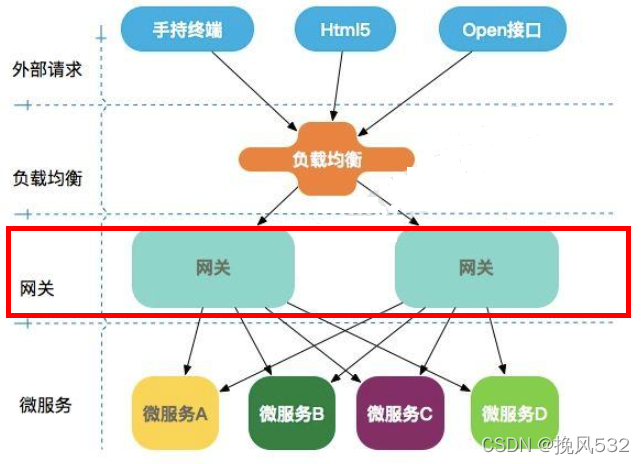
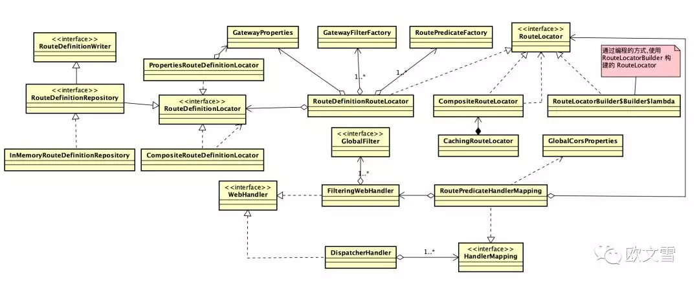

https://blog.csdn.net/qq_45076180/article/details/117112434

[网关做统一认证jwt鉴权示例](https://blog.csdn.net/weixin_43296313/article/details/121126811)
[GateWay路由及统一过滤器处理](https://blog.csdn.net/weixin_62661659/article/details/124403015)

网关在微服务中的位置

工作过程

源码解析: spring.factories 里配置了 GatewayAutoConfiguration 类

    @Configuration(proxyBeanMethods = false)
    @ConditionalOnProperty(name = "spring.cloud.gateway.enabled", matchIfMissing = true)//spring.cloud.gateway.enabled配置项必须为true，自动配置才生效，默认为true
    @EnableConfigurationProperties
    //自动配置前置条件：引入了WebFlux 和 HttpHandler 组件
    @AutoConfigureBefore({ HttpHandlerAutoConfiguration.class,WebFluxAutoConfiguration.class })
    //自动配置后置组件：注入Gataway之后，需要对请求负载到某一台服务器上，所以后置组件为负载均衡组件
    @AutoConfigureAfter({ GatewayLoadBalancerClientAutoConfiguration.class, GatewayClassPathWarningAutoConfiguration.class })
    @ConditionalOnClass(DispatcherHandler.class)
    public class GatewayAutoConfiguration {
        PropertiesRouteDefinitionLocator：用于从配置文件（yml/properties）中读取路由配置信息！
        RouteDefinitionLocator：把 RouteDefinition 转化为 Route
        RoutePredicateHandlerMapping：类似于 mvc 的HandlerMapping，不过这里是 Gateway实现的。用于匹配对应的请求route
        GatewayProperties：yml配置信息封装在 GatewayProperties 对象中
        AfterRoutePredicateFactory：各种路由断言工厂，正是这些断言工厂在启动时已经生成对应的bean，我们才可以在 yml 中配置一下，即可生效
        RetryGatewayFilterFactory：各种 Gateway 过滤器，正是这些过滤器在启动时已经生成对应的bean，我们才可以在 yml 中配置一下，即可生效
        GlobalFilter实现类：全局过滤器
    }

过滤器是网关拦截过滤的核心,在org.springframework.cloud.gateway.filter.factory包下有很多的拦截器.

GateWay采用的是webFlux的响应式编程，其整个流程与spring mvc 类似

Gateway的源码执行流程

    所有请求都会经过gateway的 org.springframework.web.reactive.DispatcherHandler#handle方法！
    可以看到该方法使用的就是webFlux的响应式编程,其实这就是 gateway的核心逻辑
	@Override
	public Mono<Void> handle(ServerWebExchange exchange) {
		if (this.handlerMappings == null) {
			return createNotFoundError();
		}
		if (CorsUtils.isPreFlightRequest(exchange.getRequest())) {
			return handlePreFlight(exchange);
		}
		return Flux
				// 1.遍历所有的 handlerMapping
				.fromIterable(this.handlerMappings) 
				// 2.获取对应的handlerMapping ，比如常用的 RequestMappingHandlerMapping、RoutePredicateHandlerMapping,
                    获取对应的HandlerMapping。由于是网关组件，当请求进入时，会先判断路由，所以会进入实现类RoutePredicateHandlerMapping中
				.concatMap(mapping -> mapping.getHandler(exchange))
				.next()
				.switchIfEmpty(createNotFoundError())
				// 3.获取对应的适配器HandlerAdaptor，调用对应的处理器
				.flatMap(handler -> invokeHandler(exchange, handler))
				// 4.返回处理结果
				.flatMap(result -> handleResult(exchange, result));
	}

上面代码中几个比较重要的方法说明

    RoutePredicateHandlerMapping#getHandlerInternal
        //寻找并匹配路由
		return lookupRoute(exchange)
				.flatMap((Function<Route, Mono<?>>) r -> {
					//移除上下文中旧的属性
					exchange.getAttributes().remove(GATEWAY_PREDICATE_ROUTE_ATTR);
					if (logger.isDebugEnabled()) {
						logger.debug(
								"Mapping [" + getExchangeDesc(exchange) + "] to " + r);
					}
					//把该路由与上下文绑定，后续负载均衡会用
					exchange.getAttributes().put(GATEWAY_ROUTE_ATTR, r);
					//返回 webHandler
					return Mono.just(webHandler);
				});
            lookupRoute方法会找到yml中配置的所有的路由断言工厂（Before、After、Path等等），并执行apply方法，进行路由匹配，判断是否允许请求通过！执行顺序由springboot自动配置时自己制定
                protected Mono<Route> lookupRoute(ServerWebExchange exchange) {
                    // getRoutes 获取所有的断言工厂
                    return this.routeLocator.getRoutes()
                            .concatMap(route -> Mono.just(route).filterWhen(r -> {
                                exchange.getAttributes().put(GATEWAY_PREDICATE_ROUTE_ATTR, r.getId());
                                // 先获取Route内部的predicate属性,然后调用apply方法 执行断言！判断请求是否通过
                                return r.getPredicate().apply(exchange);
                            })
                getRoutes()实际调用的是RouteDefinitionRouteLocator#gouRoutes,通过从配置文件中获取所有路由的，然后把找到的路由转换成Route
		            Flux<Route> routes = this.routeDefinitionLocator.getRouteDefinitions().map(this::convertToRoute);
				    //getRouteDefinitions() 从配置文件中获取所有路由 convertToRoute()：把找到的路由转换成Route,
                        Route是由路由id,请求URI,排序,断言,过滤器,元数据
                    convertToRoute//转换成Route对象
                        AsyncPredicate<ServerWebExchange> predicate = combinePredicates(routeDefinition);// ②将 PredicateDefinition 转换成 AsyncPredicate。
                        List<GatewayFilter> gatewayFilters = getFilters(routeDefinition); // ③将 FilterDefinition 转换成 GatewayFilter。
                        return Route.async(routeDefinition) // ④构建 Route 对象
                            .asyncPredicate(predicate)//合并predicate对象
                            .replaceFilters(gatewayFilters)
                            .build();
                        
                        asyncPredicate  
                            List<PredicateDefinition> predicates = routeDefinition.getPredicates()
                            循环predicates,用predicate.and(nextpredicate)合并

    invokeHandler获取对应的适配器方法 
        找到所有的适配器HandlerAdapter去匹配webFlux类型,simpleHandlerAdapter可以处理webFlux类型
        handlerAdapter.handle(exchange, handler);调用simpleHandlerAdapter#handle方法.
            webHandler.handle(exchange);//处理所有过滤器链，该过滤器链包括globalFilters和gatewayFilters
                return new DefaultGatewayFilterChain(combined).filter(exchange);
                在执行过滤器链中的globalFilters和gatewayFilters的filter方法时，就会为请求加上请求头、请求参数等扩展点！

Gateway的负载均衡是如何实现的？
    
    Gateway的负载均衡只需要在yml中配置 uri: lb://mall-order即可实现负载均衡，底层是由全局过滤器ReactiveLoadBalancerClientFilter的filter方法去做的！
        //1. 根据路由与上下文绑定关系, 获取原始的url：http://mall-order/order/findOrderById/1
        URI url = exchange.getAttribute(GATEWAY_REQUEST_URL_ATTR);
		String schemePrefix = exchange.getAttribute(GATEWAY_SCHEME_PREFIX_ATTR);
        //不是lb开头的则不用LoadBalance负载均衡
		if (url == null || (!"lb".equals(url.getScheme()) && !"lb".equals(schemePrefix))) {
			return chain.filter(exchange);
		}
        addOriginalRequestUrl(exchange, url);

        // 2. 通过ribbon的负载均衡算法，根据服务名 去nacos选择一个实例！
        // 该实例就有order服务真正的 url 地址：http://localhost:9001/order/findOrderById/1
        final ServiceInstance instance = choose(exchange);//负载均衡选择一台机器
    
        // 3. 拿到原生的 uri ：http://mall-order/order/findOrderById/1
        URI uri = exchange.getRequest().getURI();

        // 4. 拿服务实例instance的uri替换原生的uri地址 得到 新的url, 即将serviceid替换成ip+端口
        // 新的url: http://localhost:9001/order/findOrderById/1
        URI requestUrl = loadBalancer.reconstructURI(new DelegatingServiceInstance(instance, overrideScheme), uri);
        
        // 5. 再次记录上下文关系
        exchange.getAttributes().put(GATEWAY_REQUEST_URL_ATTR, requestUrl);
        // 6. 执行过滤器链中的其他过滤请求
        return chain.filter(exchange);

主要类说明

    Route:路由信息，包含 destination uri、predicate 和 filter。
    PredicateDefinition: Predicate 的bean定义
        private String name; // ①定义了 Predicate 的名称，它们要符固定的命名规范，为对应的工厂名称。比如AddRequestHeader=X-Request-Foo, Bar 对应了AddRequestHeaderGatewayFilterFactory 
        private Map<String, String> args = new LinkedHashMap<>(); // ②构造 Predicate 使用到的键值对参数。

    AsyncPredicate:匹配相应的 Predicate 才能被路由。 即满足Predicate条件会被转发到相应的目的地
    RoutePredicateFactory:是所有 predicate factory 的顶级接口，职责就是生产 Predicate。创建一个用于配置用途的对象（config），以其作为参数应用到 apply方法上来生产一个 Predicate 对象，再将 Predicate 对象包装成 AsyncPredicate。
    GatewayFilter:请求转发至下游服务前后的业务逻辑链。
    FilterDefinition: Filter的bean定义
        private String name; // ①
        private Map<String, String> args = new LinkedHashMap<>(); // ②
    GatewayFilterFactory:GatewayFilter 工厂，用于生产 GatewayFilter。
        GatewayFilter apply(C config); // ②核心方法，用于生产 GatewayFilter，接收一个范型参数 config 。
    GlobalFilter 实现类：全局过滤器
    GatewayProperties：外部化配置类，配置路由信息。yml配置信息封装在 GatewayProperties 对象中
        List<RouteDefinition> routes
        List<FilterDefinition> defaultFilters;//用于定义默认的 Filter 列表，默认的 Filter 会应用到每一个 Route 上，gateway 处理时会将其与 Route 中指定的 Filter 进行合并后并逐个执行。
    RouteDefinition:最终会被 RouteLocator 解析成 Route。
        List<PredicateDefinition> predicates
        List<FilterDefinition> filters
        private URI uri;  
        private int order = 0;
    RouteDefinitionRouteLocator:RouteLocator 接口核心实现类，用于将 RouteDefinition 转换成 Route。
    PropertiesRouteDefinitionLocator：用于从配置文件（yml/properties）中读取路由配置信息！
    RouteDefinitionLocator：把 RouteDefinition 转化为 Route

    RoutePredicateHandlerMapping：类似于 mvc 的HandlerMapping，不过这里是 Gateway实现的。用于匹配对应的请求route
    AfterRoutePredicateFactory：各种路由断言工厂，正是这些断言工厂在启动时已经生成对应的bean，我们才可以在 yml 中配置一下，即可生效
    RetryGatewayFilterFactory：各种 Gateway 过滤器，正是这些过滤器在启动时已经生成对应的bean，我们才可以在 yml 中配置一下，即可生效

Spring 提供了两种方式构建Route：外部化配置和编程的方式。

    编程方式:编程的方式会更加灵活。通过 fluent API RouteLocatorBuilder 来构建 RouteLocator。
        // static imports from GatewayFilters and RoutePredicates
        @Bean
        public RouteLocator customRouteLocator(RouteLocatorBuilder builder) { // ①RouteLocatorBuilder自动装配类中已经声明，可直接使用。RouteLocator 封装了对 Route 获取的定义，可简单理解成工厂模式。
            return builder.routes() // ②RouteLocatorBuilder 可以构建多个路由信息。
                .route(r -> r.host("**.abc.org").and().path("/image/png") // ③指定了 Predicates, 请求头Host需要匹配**.abc.org，通过 HostRoutePredicateFactory 产生。,请求路径需要匹配/image/png，通过 PathRoutePredicateFactory 产生。
                .filters(f ->
                    f.addResponseHeader("X-TestHeader", "foobar")) // ④指定了一个 Filter，下游服务响应后添加响应头X-TestHeader:foobar，通过AddResponseHeaderGatewayFilterFactory 产生。
                    .uri("http://httpbin.org:80") // ⑤ 指定路由转发的目的地 uri。
                )
                .build();
        }
    外部化配置
        spring:
            cloud:
                gateway: # ①"spring.cloud.gateway" 为固定前缀。
                routes: # ②定义路由信息列表，即可定义多个路由。
                - id: cookie_route # ③声明了一个 id 为 "cookie_route" 的路由。
                    uri: http://example.org # ④定义了路由的目的地 uri，即请求转发的目的地。
                    predicates: # ⑤声明 predicates，即请求满足相应的条件才能匹配成功。
                    - Cookie=chocolate, ch.p # ⑥定义了一个 Predicate，当名称为 chocolate 的 Cookie 的值匹配ch.p时 Predicate 才能够匹配，它由 CookieRoutePredicateFactory 来生产。
                    filters: # ⑦声明 filters，即路由转发前后处理的过滤器。
                    - AddRequestHeader=X-Request-Foo, Bar # ⑧定义了一个 Filter，所有的请求转发至下游服务时会添加请求头 X-Request-Foo:Bar ，由AddRequestHeaderGatewayFilterFactory 来生产。
    外部化配置是如何工作的？
        Spring boot 遵循规约大于配置的原则，starter 模块都有对应的以模块名称作前缀，以 "AutoConfiguration" 后缀的自动装配类。同样的还有以模块名前缀，以Properties后缀的配置类作为支持。
        Gateway 模块自动装配类为 GatewayAutoConfiguration，对应的配置类为 GatewayProperties。
[4.7. Predicate 示例由浅入深](https://www.iocoder.cn/Spring-Cloud-Gateway/ouwenxue/intro/)        
        
                
        
        
        
        
        
        
        
        
        
        
        
        
        

