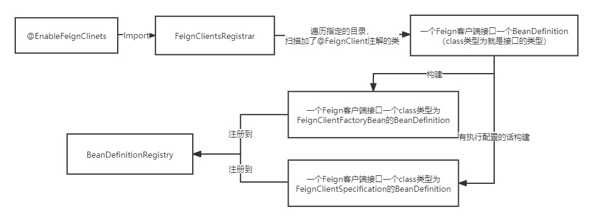

[OpenFeign之FeignClient动态代理生成原理](https://mp.weixin.qq.com/s?__biz=Mzg5MDczNDI0Nw==&mid=2247484185&idx=1&sn=efb3a1f459be9970126269234ff813e7&chksm=cfd950d1f8aed9c7c9ec6bc8b00c376d9777aa6d6aa2b93ccf6a4b4376adbed8c4f3e1e3754b&scene=21#wechat_redirect)

[OpenFeign原来是这么基于Ribbon来实现负载均衡的](https://mp.weixin.qq.com/s?__biz=Mzg5MDczNDI0Nw==&mid=2247484211&idx=1&sn=13b1cb0832bfae9a6d2369193700fd19&chksm=cfd950fbf8aed9ed473a0e170480770c311f1b637607332a0df15f32e2e9a446f8bc97f0b295&scene=21#wechat_redirect)

@EnableFeignClients作用源码剖析

    使用Feign，需要使用@EnableFeignClients，@EnableFeignClients的作用可以扫描指定包路径下的@FeignClient注解，也可以声明配置类；
    @EnableFeignClients注解其实就是整个feign的入口,该注解上有个@Import(FeignClientsRegistrar.class),FeignClientsRegistrar实现了ImportBeanDefinitionRegistrar
    查看实现方法registerBeanDefinitions
        registerDefaultConfiguration(metadata, registry);//注入一些配置，就是对EnableFeignClients注解属性的解析,实际是注入了一个FeignClientSpecification的bean定义
        registerFeignClients(metadata, registry);
            ClassPathScanningCandidateComponentProvider scanner = getScanner();//获取扫描器
            annotationTypeFilter = new AnnotationTypeFilter(FeignClient.class);//创建过滤器,用来过滤@FeignClient注解
            metadata.getAnnotationAttributes(EnableFeignClients.class.getName());//找到@EnableFeignClients标注的类所在报名作为扫描包
            scanner.findCandidateComponents(basePackage)//扫描包下的类,注册成bean定义
            registerClientConfiguration//每个Feign的客户端的配置类封装成一个FeignClientSpecification的BeanDefinition，注册到spring容器中。后面会有用.
            registerFeignClient(registry, annotationMetadata, attributes);
                重新构造了一个BeanDefinition，这个BeanDefinition的指定的class类型是FeignClientFactoryBean
    总结:这个类的主要作用是扫描指定（不指定就默认路径下的）所有加了@FeignClient注解的类，然后每个类都会生成一个BeanDefinition，随后遍历每个BeanDefinition，然后取出每个@FeignClient注解的属性，
        构造新的BeanDefinition，传入FeignClientFactoryBean的class，随后注入到spring容器中；同时有配置类的也会将配置类构件出一个bean class
        为FeignClientSpecification的BeanDefinition注入到spring容器中。
            
    
Feign客户端接口动态代理生成源码剖析

    FeignAutoConfiguration类分析
        //注入了上面提到的FeignClientSpecification,然后设置到FeignContext中,并将FeignContext注入到容器
        //一个Feign客户端的对应一个FeignClientSpecification
        @Autowired(required = false)
    	private List<FeignClientSpecification> configurations = new ArrayList<>();
        @Bean
        public FeignContext feignContext() {
            FeignContext context = new FeignContext();
            context.setConfigurations(this.configurations);
            return context;
        }
     
    FeignContext类分析   
        //FeignContext继承了NamedContextFactory，构造的时候，传入了FeignClientsConfiguration，这个玩意也很重要
        public class FeignContext extends NamedContextFactory<FeignClientSpecification> {
          public FeignContext() {
            super(FeignClientsConfiguration.class, "feign", "feign.client.name");
          }
        }

