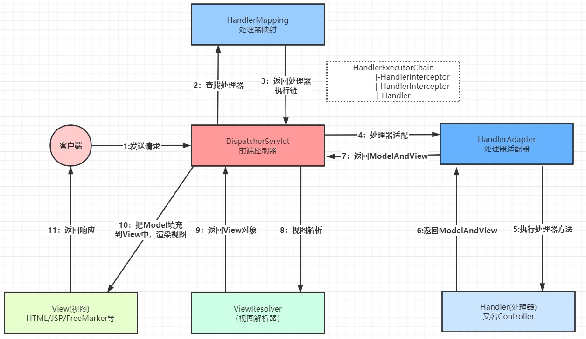

[父子容器问题](https://blog.csdn.net/qq_43842093/article/details/122008820)
1.相同类名(全限定类名)的bean在创建时会冲突,而父子容器不会冲突.

2.子容器能访问父容器,父容器不能访问子容器,controller能注入service/dao当属性, 而service/dao不能注入controller,避免不必要的错误.

3.父容器加载的属性变量只是对父容器spring本身的对象可见,如果在父容器中有properties文件，其中的属性子容器@value是访问不到的！跨容器了！

那么在springboot里,上面的问题还存在吗? 或者如果是基于注解的而非基于xml配置文件的还会有上面的问题吗?
[mvc用了父子容器而springboot没有用父子容器?](https://www.zhihu.com/question/488723652)

[springCloud中的父子容器问题](https://cloud.tencent.com/developer/article/1403379)

[从Servlet和SpringBoot整合理解父子容器](https://blog.csdn.net/daliucheng/article/details/121408902)

RequestDispatcher是个啥?

#一个请求的执行流程

1.DispatcherServlet中的doservice从哪儿调的?

    DispatcherServlet是前端控制器,Dispatcher有收发的意思,可以理解为前端请求的收发的地方.
    一个请求发送到javaweb,通常默认发送到servlet#service方法,DispatcherServlet也不例外,在其父类FrameworkServlet#service方法
    HttpMethod.resolve //解析http方法是否patch方法或者为空, http方法有GET, HEAD, POST, PUT, PATCH, DELETE, OPTIONS, TRACE
        是patch方法or为null则processRequest() // patch方法是对put方法的补充,是局部更新,此处不做详细跟踪,这个方法里面也是调用了doService方法
        否则super.service,即HttpServlet#service,此处根据不同的httpMethod调用不同的方法
        GET:doGet, HEAD:doHead, POST:doPost, PUT:doPut, DELETE:doDelete, OPTIONS:doOptions, TRACE:doTrace
        上面这些do**方法在FrameworkServlet有实现,下面以doGet为例进行记录
        doGet里实际调用processRequest方法
            获取LocaleContext/ServletRequestAttributes/WebAsyncManager
            registerCallableInterceptor注册一个回调拦截器RequestBindingInterceptor,是以FrameworkServlet的classname为key
            initContextHolders //初始化上下文的持有者
                LocaleContextHolder.setLocaleContext //初始化本地上下文,inheritable可继承的
                    判断是否可继承的上下文,默认false,false则将localeContext放入localeContextHolder,否则放入inheritableLocaleContextHolder
                RequestContextHolder.setRequestAttributes //设置请求属性
                    判断是否可继承的上下文,默认false,false则将localeContext放入requestAttributesHolder,否则放入inheritableRequestAttributesHolder
            doService //实际调用DispatcherServlet#doService
                向Request的attribute中放入对象:上下文对象,国际化支持解析器,主题解析器,主题
                doDispatch(request, response);//真正的进行处理转发
                    checkMultipart(request);//判断请求是不是文件上传的请求
                        multipartResolver.resolveMultipart //如果是文件上传请求,则将request转换为MultipartHttpServletRequest
                    getHandler(processedRequest) //获取一个执行器处理链HandlerExecutionChain
                        循环所有的HandlerMappings,调用HandlerMapping#getHandler,实际调用的AbstractHandlerMapping#getHandler
                            getHandlerInternal(request);//实际调用AbstractHandlerMethodMapping#getHandlerInternal
                                getUrlPathHelper().getLookupPathForRequest(request);//获取UrlPathHelper对象，用于来解析从们的request中解析出请求映射路径
                                    如果允许全路径查找,则调用getPathWithinApplication()默认是不允许
                                        找到去除了{contextpath}的URI,详细参考"8.映射路径说明"
                                    如果不允许全路径查找,则getPathWithinServletMapping(如果没查找到再调用全路径查找getPathWithinApplication)
                                        找到去除了{contextpath}/{servletPath}的URI,也就是只有方法上的requestmapping的值
                                lookupHandlerMethod(lookupPath, request);//通过请求映射路径获取HandlerMethod对象
                                    mappingRegistry.getMappingsByUrl;//通过请求映射路径获取List<RequestMappingInfo>
                                    addMatchingMappings //将上一步获取到的List<RequestMappingInfo>循环
                                        把requestMappingInfo和hanlderMethod封装成一个Match放入匹配器列表中
                                        如果匹配器列表List<Match> 不为空,则循环找出最匹配的handlerMethod.
                            obtainApplicationContext().getBean(handlerName);// 如果解析出来的handler是String,则需要通过容器创建handler了
                            getHandlerExecutionChain(handler, request);根据处理器来构建处理器执行链对象
                                urlPathHelper.getLookupPathForRequest//从request找到请求映射路径,上面有这个方法的解析
                                循环所有的拦截器对象,判断拦截器是否实现了HandlerInterceptor
                                    如果实现了,则调用拦截器的matches对映射路径进行匹配,以此来判断是否要添加到拦截器执行链里去.
                                    如果没实现,则直接添加到拦截器执行链里(说明是全局的拦截器)
                            getCorsHandlerExecutionChain(request, executionChain, config);//如果是跨域的请求,再构建处理器执行链对象
                                向执行链里加入一个拦截器,PreFlightHandler或CorsInterceptor.
                    getHandlerAdapter //根据Handler选择我们的HandlerAdpater对象,默认是@RequestMappingHandlerAdapter对象,此处参考"2.使用controller的3种方式"
                        循环我们的系统配置配置的handlerAdapters
                            调用HandlerAdapter#supports方法看适配器是否支持handler,是则立即返回,具体HandlerAdapter有哪些,参考"2.使用controller的3种方式"
                            此处是RequestMappingHandlerAdapter,默认支持.
                    HandlerExecutionChain#applyPreHandle //调用拦截器链的applyPreHandle方法.
                        循环拦截器,调用interceptor.preHandle
                        如果有拦截器的preHandle返回false,则调用triggerAfterCompletion,即触发AfterCompletion方法
                            循环拦截器,调用interceptor.afterCompletion方法.
                    HandlerAdapter#handle 通过适配器真正的调用目标方法,实际调用AbstractHandlerMethodAdapter#handle
                        handleInternal //实际调用RequestMappingHandlerAdapter#handleInternal方法
                            checkRequest(request);//检查请求对象:是否支持请求方法,是否需要session
                            invokeHandlerMethod(request, response, handlerMethod);//对HandlerMethod进行适配
                                getDataBinderFactory(handlerMethod);//获取容器中全局配置的InitBinder和当前HandlerMethod所对应的Controller中配置的InitBinder，用于进行参数的绑定
                                    todo...
                                getModelFactory(handlerMethod, binderFactory);//获取容器中全局配置的ModelAttribute和当前HandlerMethod所对应的Controller中配置的ModelAttribute，这些配置的方法将会在目标方法调用之前进行调用
                                    todo..
                                createInvocableHandlerMethod(handlerMethod);//将handlerMethod封装为一个ServletInvocableHandlerMethod对象，该对象用于对当前request的整体调用流程进行了封装
                                    HanlderMethod
                                        --InvocableHandlerMethod:invokeForRequest()
                                      	   --ServletInvocableHandlerMethod:invokeAndHandle()
                                设置参数解析器/返回参数解析器
                                initModel//调用我们标注了@ModelAttribute的方法,主要是为我们的目标方法预加载
                                    todo...
                                WebAsyncUtils.createAsyncWebRequest(request, response);//异步请求,servlet3.0的异步
                                    获取当前的AsyncWebRequest，这里AsyncWebRequest的主要作用是用于判断目标handler的返回值是否为WebAsyncTask或DefferredResult，如果是这两种中的一种，
                                    则说明当前请求的处理应该是异步的。所谓的异步，指的是当前请求会将Controller中封装的业务逻辑放到一个线程池中进行调用，待该调用有返回结果之后再返回到response中。
                                    这种处理的优点在于用于请求分发的线程能够解放出来，从而处理更多的请求，只有待目标任务完成之后才会回来将该异步任务的结果返回。
                                WebAsyncUtils.getAsyncManager(request);//封装异步任务的线程池，request和interceptors到WebAsyncManager中
                                invocableMethod.invokeAndHandle //对请求参数进行处理，调用目标HandlerMethod，并且将返回值封装为一个ModelAndView对象
                                    todo...
                                getModelAndView//对封装的ModelAndView进行处理，主要是判断当前请求是否进行了重定向，如果进行了重定向，还会判断是否需要将FlashAttributes封装到新的请求中
                            处理response中的Cache的过期时间
                    applyDefaultViewName //处理默认的视图名称
                    HandlerExecutionChain#applyPostHandle //调用拦截器链的applyPostHandle方法.
                        倒序遍历所有的拦截器,然后执行postHandle方法.
                    processDispatchResult //处理返回的结果,主要是渲染视图.
                        todo...
                    
            resetContextHolders //重置LocaleContext和RequestAttributes
            publishRequestHandledEvent //发布请求已处理事件 ServletRequestHandledEvent
                webApplicationContext.publishEvent(ServletRequestHandledEvent)
                    AbstractApplicationContext#publishEvent 
                        getApplicationEventMulticaster().multicastEvent //广播事件
                            SimpleApplicationEventMulticaster#multicastEvent
                                取出所有的ApplicationListener进行循环
                                    invokeListener -> doInvokeListener
                                        listener.onApplicationEvent//调用listener的监听方法onApplicationEvent

2.使用controller的3种方式: 不同的方式对应不同的适配器,调用也稍微有点区别
    
    1.实现Controller接口
        SimpleControllerHandlerAdapter
    2.实现HttpRequestHandler
        HttpRequestHandlerAdapter
    3.使用@Controller标注
        RequestMappingHandlerAdapter
    HandlerAdapter有以下几种
    ---AbstractHandlerMethodAdapter
         ---RequestMappingHandlerAdapter
    ---SimpleServletHandlerAdapter
    ---HttpRequestHandlerAdapter
    ---SimpleControllerHandlerAdapter

3.参数是怎么封装的?
    spring是可以拿到参数的,而mybatis拿不到(要通过@param注解才行,jdk1.8之后就可以拿得到了),是因为spring操作了底层的字节码
4.拦截器是怎么走的?
    拦截器preHandle()返回true是放行,返回false是不放行
5.handlermapping和handlerAdapter什么时候封装的?
    在DispatcherServlet#initStrategies中,
    
    RequestMappingHandlerMapping的父类AbstractHandlerMethodMapping实现了InitializingBean接口
    RequestMappingHandlerMapping重写了afterPropertiesSet方法
        里面调用了super.afterPropertiesSet();//实际就是AbstractHandlerMethodMapping#afterPropertiesSet()
            initHandlerMethods();处理@RequestMapping的路径和方法的映射关系,说白了该方法就是去把我们的Controller中的RequestMapping注解的路径和方法进行一一映射保存
                todo...
    
6.spring父子容器
7.看下鼓泡的springmvc的课程,好像更清晰一点.
8.映射路径说明

    URL  http://localhost:8080/{contextpath}/{servletPath}/hello.do
    URI  {contextpath}/{servletPath}/hello.do
    {}中的东西可有可无
    
9.spring整合springmvc的源码? 好像不用,因为springmvc就是利用了spring的扩展点吧?到时候可以看一看

